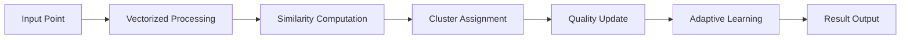

# 🚀 NCS API User Guide

**Complete guide for integrating and using the NeuroCluster Streamer API in your applications**

This guide is designed for software engineers, data scientists, and developers who want to integrate the NCS clustering algorithm into their projects. Whether you're building real-time analytics, recommendation systems, or data processing pipelines, this guide will help you get the most out of the NCS API.

---

## 📋 Table of Contents

1. [Quick Start](#-quick-start)
2. [Understanding NCS Algorithm](#-understanding-ncs-algorithm)
3. [Getting Started](#-getting-started)
4. [API Integration](#-api-integration)
5. [SDK Usage](#-sdk-usage)
6. [Implementation Patterns](#-implementation-patterns)
7. [Real-World Use Cases](#-real-world-use-cases)
8. [Performance Optimization](#-performance-optimization)
9. [Error Handling](#-error-handling)
10. [Monitoring & Debugging](#-monitoring--debugging)
11. [Best Practices](#-best-practices)
12. [Advanced Features](#-advanced-features)

---

## ⚡ Quick Start

### 30-Second Integration

```python
from ncs_client import NCSClient

# Initialize client
client = NCSClient(
    api_key="your-api-key",
    base_url="https://your-ncs-api.com"
)

# Process your data
points = [[1.0, 2.0, 3.0], [1.1, 2.1, 3.1], [5.0, 6.0, 7.0]]
result = client.process_points(points)

# Get results
print(f"Found {result.clusters_found} clusters")
print(f"Detected {len(result.outliers)} outliers")
```

### What You Get

✅ **Real-time clustering** with sub-millisecond latency  
✅ **Adaptive intelligence** that learns from your data patterns  
✅ **Outlier detection** to identify anomalous data points  
✅ **Quality metrics** to assess clustering performance  
✅ **Scalable architecture** supporting millions of points per day  

---

## 🧠 Understanding NCS Algorithm

### What is NeuroCluster Streamer?

The NeuroCluster Streamer (NCS) is an advanced clustering algorithm designed for real-time data streams. Unlike traditional clustering methods that require complete datasets, NCS processes points one at a time, continuously adapting to new patterns.

### Key Capabilities

#### 1. **Adaptive Clustering**
```
Traditional: [All Data] → [Process] → [Fixed Clusters]
NCS:        [Point 1] → [Update] → [Point 2] → [Adapt] → [Point 3] → [Evolve]
```

#### 2. **Multi-Layer Intelligence**

| Layer | Purpose | Technology |
|-------|---------|------------|
| **Similarity Detection** | Find related points | Vectorized cosine similarity |
| **Outlier Analysis** | Identify anomalies | Multi-factor scoring |
| **Quality Assessment** | Measure clustering health | Statistical validation |
| **Adaptive Thresholds** | Dynamic parameter tuning | Machine learning optimization |

#### 3. **Performance Architecture**



### Algorithm Benefits

| Feature | Benefit | Use Case |
|---------|---------|----------|
| **Real-time Processing** | Sub-millisecond response | Live analytics dashboards |
| **Memory Efficient** | Bounded resource usage | High-throughput systems |
| **Adaptive Learning** | Improves with more data | Evolving data patterns |
| **Outlier Detection** | Automatic anomaly identification | Fraud detection, quality control |
| **Quality Metrics** | Built-in performance assessment | Model validation, monitoring |

---

## 🚀 Getting Started

### 1. Account Setup

#### Create API Credentials
```bash
# Option 1: Using our web interface
curl -X POST "https://your-ncs-api.com/auth/register" \
     -H "Content-Type: application/json" \
     -d '{
       "username": "your-username",
       "email": "your-email@company.com",
       "password": "secure-password"
     }'

# Option 2: Request enterprise access
# Contact: enterprise@your-ncs-api.com
```

#### Get Your API Key
```bash
curl -X POST "https://your-ncs-api.com/auth/api-keys" \
     -H "Authorization: Bearer YOUR_JWT_TOKEN" \
     -H "Content-Type: application/json" \
     -d '{
       "name": "My Application",
       "scopes": ["read", "write"]
     }'
```

### 2. Environment Setup

#### Install SDK

**Python:**
```bash
pip install ncs-client
```

**JavaScript/Node.js:**
```bash
npm install @ncs/client
```

**Direct HTTP:**
No installation required - use any HTTP client

#### Configuration
```python
# Python configuration
import os

NCS_CONFIG = {
    "api_key": os.getenv("NCS_API_KEY"),
    "base_url": os.getenv("NCS_BASE_URL", "https://api.ncs-cluster.com"),
    "timeout": 30,
    "max_retries": 3
}
```

```javascript
// JavaScript configuration
const config = {
    apiKey: process.env.NCS_API_KEY,
    baseUrl: process.env.NCS_BASE_URL || 'https://api.ncs-cluster.com',
    timeout: 30000,
    maxRetries: 3
};
```

### 3. First API Call

```python
from ncs_client import NCSClient

# Initialize client
client = NCSClient(
    api_key="your-api-key-here",
    base_url="https://api.ncs-cluster.com"
)

# Test connection
health = client.health_check()
print(f"API Status: {health.status}")

# Process sample data
sample_points = [
    [1.0, 2.0],      # Point in cluster 1
    [1.1, 2.1],      # Similar point (same cluster)
    [10.0, 15.0],    # Point in cluster 2
    [0.0, 100.0]     # Potential outlier
]

result = client.process_points(sample_points)

# Examine results
print(f"Clusters found: {result.clusters_found}")
print(f"Processing time: {result.processing_time_ms:.2f}ms")
print(f"Algorithm quality: {result.algorithm_quality:.3f}")

for i, cluster in enumerate(result.clusters):
    point = cluster['point']
    cluster_id = cluster['cluster_id']
    print(f"Point {point} → Cluster {cluster_id}")

for outlier in result.outliers:
    point = outlier['point']
    score = outlier['outlier_score']
    print(f"Outlier: {point} (score: {score:.3f})")
```

---

## 🔌 API Integration

### HTTP API Reference

#### Base URL Structure
```
https://api.ncs-cluster.com/api/v1/
```

#### Authentication
```bash
# API Key (Recommended for applications)
curl -H "X-API-Key: your-api-key"

# JWT Token (For user sessions)
curl -H "Authorization: Bearer your-jwt-token"
```

### Core Endpoints

#### 1. Process Points
**Endpoint:** `POST /api/v1/process_points`

**Request:**
```json
{
  "points": [
    [1.0, 2.0, 3.0],
    [1.1, 2.1, 3.1],
    [5.0, 6.0, 7.0]
  ],
  "batch_mode": false,
  "algorithm_params": {
    "base_threshold": 0.71,
    "learning_rate": 0.06
  }
}
```

**Response:**
```json
{
  "request_id": "req_123e4567-e89b-12d3-a456-426614174000",
  "clusters": [
    {
      "point": [1.0, 2.0, 3.0],
      "cluster_id": 0,
      "outlier_score": 0.12
    },
    {
      "point": [1.1, 2.1, 3.1],
      "cluster_id": 0,
      "outlier_score": 0.08
    }
  ],
  "outliers": [
    {
      "point": [5.0, 6.0, 7.0],
      "outlier_score": 0.89
    }
  ],
  "algorithm_quality": 0.923,
  "processing_time_ms": 1.23,
  "points_processed": 3,
  "clusters_found": 2,
  "timestamp": "2025-06-07T14:30:45.123Z"
}
```

#### 2. Get Cluster Summary
**Endpoint:** `GET /api/v1/clusters_summary`

**Response:**
```json
{
  "total_clusters": 5,
  "active_clusters": 4,
  "clusters": [
    {
      "cluster_id": 0,
      "centroid": [1.05, 2.05, 3.05],
      "size": 150,
      "confidence": 0.89,
      "age": 3600,
      "last_updated": "2025-06-07T14:29:12.456Z"
    }
  ],
  "algorithm_stats": {
    "total_points_processed": 10000,
    "clustering_quality": 0.918,
    "memory_usage_mb": 12.4,
    "avg_processing_time_ms": 0.22
  }
}
```

#### 3. Algorithm Status
**Endpoint:** `GET /api/v1/algorithm_status`

**Response:**
```json
{
  "is_ready": true,
  "algorithm_version": "8.0",
  "uptime_seconds": 86400,
  "performance_metrics": {
    "points_per_second": 6309,
    "p95_latency_ms": 0.18,
    "p99_latency_ms": 0.31
  },
  "current_parameters": {
    "base_threshold": 0.71,
    "learning_rate": 0.06,
    "max_clusters": 30
  }
}
```

### HTTP Examples

#### cURL Examples
```bash
# Process points with cURL
curl -X POST "https://api.ncs-cluster.com/api/v1/process_points" \
     -H "X-API-Key: your-api-key" \
     -H "Content-Type: application/json" \
     -d '{
       "points": [[1,2,3], [1.1,2.1,3.1], [10,20,30]]
     }'

# Get cluster summary
curl -H "X-API-Key: your-api-key" \
     "https://api.ncs-cluster.com/api/v1/clusters_summary"

# Health check (no auth required)
curl "https://api.ncs-cluster.com/health"
```

#### Python requests
```python
import requests

# Setup session with authentication
session = requests.Session()
session.headers.update({
    'X-API-Key': 'your-api-key',
    'Content-Type': 'application/json'
})

# Process points
response = session.post(
    'https://api.ncs-cluster.com/api/v1/process_points',
    json={'points': [[1, 2, 3], [4, 5, 6]]}
)

if response.status_code == 200:
    result = response.json()
    print(f"Found {result['clusters_found']} clusters")
else:
    print(f"Error: {response.status_code} - {response.text}")
```

#### JavaScript fetch
```javascript
// Setup fetch with authentication
const apiCall = async (endpoint, options = {}) => {
    const response = await fetch(`https://api.ncs-cluster.com${endpoint}`, {
        headers: {
            'X-API-Key': 'your-api-key',
            'Content-Type': 'application/json',
            ...options.headers
        },
        ...options
    });
    
    if (!response.ok) {
        throw new Error(`API Error: ${response.status}`);
    }
    
    return response.json();
};

// Process points
const processPoints = async (points) => {
    const result = await apiCall('/api/v1/process_points', {
        method: 'POST',
        body: JSON.stringify({ points })
    });
    
    console.log(`Found ${result.clusters_found} clusters`);
    return result;
};

// Usage
processPoints([[1, 2, 3], [4, 5, 6]])
    .then(result => console.log(result))
    .catch(error => console.error(error));
```

---

## 📚 SDK Usage

### Python SDK

#### Installation & Setup
```bash
pip install ncs-client
```

#### Basic Usage
```python
from ncs_client import NCSClient, AsyncNCSClient
import asyncio

# Synchronous client
client = NCSClient(
    api_key="your-api-key",
    base_url="https://api.ncs-cluster.com",
    timeout=30,
    max_retries=3
)

# Process single batch
points = [[1, 2, 3], [4, 5, 6], [7, 8, 9]]
result = client.process_points(points)

print(f"Clusters: {result.clusters_found}")
print(f"Quality: {result.algorithm_quality:.3f}")

# Get detailed cluster information
clusters = client.get_clusters_summary()
for cluster in clusters.clusters:
    print(f"Cluster {cluster.cluster_id}: {cluster.size} points")
```

#### Async Usage
```python
# Asynchronous client for high-performance applications
async def process_multiple_batches():
    async_client = AsyncNCSClient(
        api_key="your-api-key",
        base_url="https://api.ncs-cluster.com"
    )
    
    # Process multiple batches concurrently
    batches = [
        [[1, 2], [3, 4]],
        [[5, 6], [7, 8]],
        [[9, 10], [11, 12]]
    ]
    
    tasks = [async_client.process_points(batch) for batch in batches]
    results = await asyncio.gather(*tasks)
    
    total_clusters = sum(r.clusters_found for r in results)
    print(f"Total clusters across all batches: {total_clusters}")
    
    await async_client.close()

# Run async example
asyncio.run(process_multiple_batches())
```

#### Streaming Processing
```python
from ncs_client import StreamingClient

# Real-time streaming client
streaming_client = StreamingClient(
    api_key="your-api-key",
    base_url="https://api.ncs-cluster.com"
)

# Process points one at a time
def process_stream(data_stream):
    for point in data_stream:
        result = streaming_client.process_single_point(point)
        
        if result.is_outlier:
            print(f"Outlier detected: {point} (score: {result.outlier_score:.3f})")
        else:
            print(f"Point {point} → Cluster {result.cluster_id}")
        
        # Get real-time statistics
        if streaming_client.points_processed % 100 == 0:
            stats = streaming_client.get_current_stats()
            print(f"Processed {stats.points_processed} points, "
                  f"Quality: {stats.algorithm_quality:.3f}")

# Simulate data stream
import random
data_stream = [[random.random(), random.random()] for _ in range(1000)]
process_stream(data_stream)
```

#### Configuration Options
```python
# Advanced client configuration
client = NCSClient(
    api_key="your-api-key",
    base_url="https://api.ncs-cluster.com",
    
    # Performance settings
    timeout=30,
    max_retries=3,
    retry_delay=1.0,
    
    # Connection settings
    verify_ssl=True,
    connection_pool_size=10,
    
    # Logging
    log_level="INFO",
    enable_metrics=True,
    
    # Algorithm defaults
    default_algorithm_params={
        "base_threshold": 0.71,
        "learning_rate": 0.06,
        "max_clusters": 50
    }
)
```

### JavaScript SDK

#### Installation & Setup
```bash
npm install @ncs/client
```

#### Basic Usage
```javascript
const { NCSClient } = require('@ncs/client');

// Initialize client
const client = new NCSClient({
    apiKey: 'your-api-key',
    baseUrl: 'https://api.ncs-cluster.com',
    timeout: 30000
});

// Process points
const processPoints = async () => {
    try {
        const points = [[1, 2, 3], [4, 5, 6], [7, 8, 9]];
        const result = await client.processPoints(points);
        
        console.log(`Found ${result.clustersFound} clusters`);
        console.log(`Algorithm quality: ${result.algorithmQuality.toFixed(3)}`);
        
        // Handle clusters
        result.clusters.forEach(cluster => {
            console.log(`Point ${cluster.point} → Cluster ${cluster.clusterId}`);
        });
        
        // Handle outliers
        result.outliers.forEach(outlier => {
            console.log(`Outlier: ${outlier.point} (score: ${outlier.outlierScore.toFixed(3)})`);
        });
        
    } catch (error) {
        console.error('Processing failed:', error.message);
    }
};

processPoints();
```

#### Real-time Processing
```javascript
const { StreamingNCSClient } = require('@ncs/client');

// Streaming client for real-time applications
class RealTimeProcessor {
    constructor() {
        this.client = new StreamingNCSClient({
            apiKey: 'your-api-key',
            baseUrl: 'https://api.ncs-cluster.com'
        });
        
        this.setupEventHandlers();
    }
    
    setupEventHandlers() {
        // Handle new clusters
        this.client.on('newCluster', (cluster) => {
            console.log(`New cluster created: ${cluster.id}`);
        });
        
        // Handle outliers
        this.client.on('outlierDetected', (outlier) => {
            console.log(`Outlier detected: ${outlier.point} (score: ${outlier.score})`);
        });
        
        // Handle quality updates
        this.client.on('qualityUpdate', (stats) => {
            console.log(`Quality updated: ${stats.quality.toFixed(3)}`);
        });
    }
    
    async processDataStream(dataStream) {
        for (const point of dataStream) {
            await this.client.processPoint(point);
        }
    }
}

// Usage
const processor = new RealTimeProcessor();
const dataStream = [[1, 2], [3, 4], [5, 6]];
processor.processDataStream(dataStream);
```

#### TypeScript Support
```typescript
import { NCSClient, ProcessPointsResponse, ClusterInfo } from '@ncs/client';

interface Point {
    coordinates: number[];
    metadata?: Record<string, any>;
}

class TypedNCSProcessor {
    private client: NCSClient;
    
    constructor(apiKey: string) {
        this.client = new NCSClient({
            apiKey,
            baseUrl: 'https://api.ncs-cluster.com'
        });
    }
    
    async processTypedPoints(points: Point[]): Promise<ProcessPointsResponse> {
        const coordinates = points.map(p => p.coordinates);
        return await this.client.processPoints(coordinates);
    }
    
    async getClusterInfo(): Promise<ClusterInfo[]> {
        const summary = await this.client.getClustersSummary();
        return summary.clusters;
    }
}

// Usage with type safety
const processor = new TypedNCSProcessor('your-api-key');
const points: Point[] = [
    { coordinates: [1, 2, 3] },
    { coordinates: [4, 5, 6] },
    { coordinates: [7, 8, 9] }
];

processor.processTypedPoints(points)
    .then(result => console.log(`Found ${result.clustersFound} clusters`))
    .catch(error => console.error('Error:', error));
```

---

## 🏗️ Implementation Patterns

### 1. Batch Processing Pattern

**Use Case:** Processing large datasets efficiently

```python
from ncs_client import NCSClient
import numpy as np
from typing import List, Generator

class BatchProcessor:
    def __init__(self, api_key: str, batch_size: int = 1000):
        self.client = NCSClient(api_key=api_key)
        self.batch_size = batch_size
    
    def process_large_dataset(self, dataset: List[List[float]]) -> dict:
        """Process large dataset in manageable batches."""
        total_points = len(dataset)
        total_clusters = 0
        total_outliers = 0
        processing_times = []
        
        print(f"Processing {total_points} points in batches of {self.batch_size}")
        
        for i, batch in enumerate(self._create_batches(dataset)):
            print(f"Processing batch {i+1}/{(total_points-1)//self.batch_size + 1}")
            
            result = self.client.process_points(batch)
            
            total_clusters += result.clusters_found
            total_outliers += len(result.outliers)
            processing_times.append(result.processing_time_ms)
            
            # Progress update
            processed = min((i+1) * self.batch_size, total_points)
            print(f"Processed: {processed}/{total_points} points")
        
        return {
            'total_points': total_points,
            'total_clusters': total_clusters,
            'total_outliers': total_outliers,
            'avg_processing_time_ms': np.mean(processing_times),
            'total_processing_time_ms': sum(processing_times)
        }
    
    def _create_batches(self, dataset: List) -> Generator[List, None, None]:
        """Split dataset into batches."""
        for i in range(0, len(dataset), self.batch_size):
            yield dataset[i:i + self.batch_size]

# Usage
processor = BatchProcessor(api_key="your-api-key", batch_size=500)

# Generate large dataset
large_dataset = np.random.rand(10000, 5).tolist()

# Process efficiently
results = processor.process_large_dataset(large_dataset)
print(f"Total clusters found: {results['total_clusters']}")
print(f"Average processing time: {results['avg_processing_time_ms']:.2f}ms per batch")
```

### 2. Real-time Streaming Pattern

**Use Case:** Processing continuous data streams

```python
import asyncio
import time
from collections import deque
from typing import Callable, Optional

class RealTimeClusteringService:
    def __init__(self, api_key: str):
        self.client = AsyncNCSClient(api_key=api_key)
        self.point_buffer = deque(maxlen=100)  # Buffer for batch processing
        self.outlier_callbacks = []
        self.cluster_callbacks = []
        self.is_running = False
        
    def add_outlier_handler(self, callback: Callable):
        """Add callback for outlier detection."""
        self.outlier_callbacks.append(callback)
        
    def add_cluster_handler(self, callback: Callable):
        """Add callback for cluster updates."""
        self.cluster_callbacks.append(callback)
    
    async def start_processing(self, flush_interval: float = 1.0):
        """Start real-time processing with periodic flushing."""
        self.is_running = True
        
        # Start flush task
        flush_task = asyncio.create_task(self._flush_periodically(flush_interval))
        
        try:
            await flush_task
        except KeyboardInterrupt:
            self.is_running = False
            await self.client.close()
    
    async def add_point(self, point: List[float], metadata: dict = None):
        """Add point to processing queue."""
        self.point_buffer.append({
            'point': point,
            'metadata': metadata,
            'timestamp': time.time()
        })
        
        # Flush if buffer is full
        if len(self.point_buffer) >= self.point_buffer.maxlen:
            await self._flush_buffer()
    
    async def _flush_buffer(self):
        """Process all points in buffer."""
        if not self.point_buffer:
            return
            
        # Extract points for processing
        buffer_items = list(self.point_buffer)
        points = [item['point'] for item in buffer_items]
        
        # Clear buffer
        self.point_buffer.clear()
        
        try:
            # Process batch
            result = await self.client.process_points(points)
            
            # Handle results
            await self._handle_results(result, buffer_items)
            
        except Exception as e:
            print(f"Processing error: {e}")
            # Re-add points to buffer for retry
            self.point_buffer.extend(buffer_items)
    
    async def _handle_results(self, result, buffer_items):
        """Handle processing results and trigger callbacks."""
        # Handle outliers
        for outlier in result.outliers:
            # Find original metadata
            original_item = None
            for item in buffer_items:
                if item['point'] == outlier['point']:
                    original_item = item
                    break
            
            # Trigger outlier callbacks
            for callback in self.outlier_callbacks:
                try:
                    await callback(outlier, original_item)
                except Exception as e:
                    print(f"Outlier callback error: {e}")
        
        # Handle clusters
        for cluster in result.clusters:
            # Find original metadata
            original_item = None
            for item in buffer_items:
                if item['point'] == cluster['point']:
                    original_item = item
                    break
            
            # Trigger cluster callbacks
            for callback in self.cluster_callbacks:
                try:
                    await callback(cluster, original_item)
                except Exception as e:
                    print(f"Cluster callback error: {e}")
    
    async def _flush_periodically(self, interval: float):
        """Periodically flush buffer."""
        while self.is_running:
            await asyncio.sleep(interval)
            await self._flush_buffer()

# Usage example
async def outlier_handler(outlier, metadata):
    """Handle detected outliers."""
    print(f"🚨 Outlier detected: {outlier['point']} "
          f"(score: {outlier['outlier_score']:.3f})")
    
    if metadata:
        print(f"   Metadata: {metadata['metadata']}")
        print(f"   Timestamp: {metadata['timestamp']}")

async def cluster_handler(cluster, metadata):
    """Handle cluster assignments."""
    print(f"📊 Point {cluster['point']} → Cluster {cluster['cluster_id']}")

# Setup service
service = RealTimeClusteringService(api_key="your-api-key")
service.add_outlier_handler(outlier_handler)
service.add_cluster_handler(cluster_handler)

# Simulate real-time data
async def simulate_data_stream():
    """Simulate incoming data points."""
    import random
    
    for i in range(100):
        # Generate random point
        point = [random.uniform(0, 10), random.uniform(0, 10)]
        metadata = {"sensor_id": f"sensor_{i % 5}", "value": random.random()}
        
        await service.add_point(point, metadata)
        await asyncio.sleep(0.1)  # Simulate real-time arrival

# Run the service
async def main():
    # Start both the service and data simulation
    await asyncio.gather(
        service.start_processing(flush_interval=0.5),
        simulate_data_stream()
    )

# Execute
# asyncio.run(main())
```

### 3. Microservice Integration Pattern

**Use Case:** Integrating NCS into a microservice architecture

```python
from fastapi import FastAPI, HTTPException, BackgroundTasks
from pydantic import BaseModel
from typing import List, Optional
import redis
import json
import uuid

app = FastAPI(title="Data Processing Service with NCS")

# Configuration
class ServiceConfig:
    NCS_API_KEY = "your-ncs-api-key"
    REDIS_URL = "redis://localhost:6379"
    RESULT_TTL = 3600  # 1 hour

config = ServiceConfig()

# Initialize clients
ncs_client = NCSClient(api_key=config.NCS_API_KEY)
redis_client = redis.from_url(config.REDIS_URL, decode_responses=True)

# Request/Response models
class ProcessingRequest(BaseModel):
    points: List[List[float]]
    callback_url: Optional[str] = None
    metadata: Optional[dict] = None

class ProcessingResponse(BaseModel):
    job_id: str
    status: str
    message: str

class JobStatus(BaseModel):
    job_id: str
    status: str
    progress: float
    result: Optional[dict] = None
    error: Optional[str] = None

# Background processing
async def process_points_async(job_id: str, request: ProcessingRequest):
    """Process points asynchronously."""
    try:
        # Update status
        await update_job_status(job_id, "processing", 0.0)
        
        # Process with NCS
        result = ncs_client.process_points(request.points)
        
        # Store result
        job_result = {
            "clusters_found": result.clusters_found,
            "outliers_detected": len(result.outliers),
            "algorithm_quality": result.algorithm_quality,
            "processing_time_ms": result.processing_time_ms,
            "clusters": result.clusters,
            "outliers": result.outliers
        }
        
        # Update status with result
        await update_job_status(job_id, "completed", 1.0, job_result)
        
        # Send callback if provided
        if request.callback_url:
            await send_callback(request.callback_url, job_result)
            
    except Exception as e:
        await update_job_status(job_id, "failed", 0.0, error=str(e))

async def update_job_status(job_id: str, status: str, progress: float, 
                          result: dict = None, error: str = None):
    """Update job status in Redis."""
    job_data = {
        "job_id": job_id,
        "status": status,
        "progress": progress,
        "result": result,
        "error": error,
        "updated_at": time.time()
    }
    
    redis_client.setex(
        f"job:{job_id}", 
        config.RESULT_TTL, 
        json.dumps(job_data)
    )

async def send_callback(callback_url: str, result: dict):
    """Send result to callback URL."""
    import httpx
    
    async with httpx.AsyncClient() as client:
        try:
            await client.post(callback_url, json=result, timeout=30)
        except Exception as e:
            print(f"Callback failed for {callback_url}: {e}")

# API endpoints
@app.post("/api/v1/process", response_model=ProcessingResponse)
async def process_points(request: ProcessingRequest, background_tasks: BackgroundTasks):
    """Submit points for processing."""
    job_id = str(uuid.uuid4())
    
    # Add background task
    background_tasks.add_task(process_points_async, job_id, request)
    
    # Return job ID
    return ProcessingResponse(
        job_id=job_id,
        status="submitted",
        message="Processing started"
    )

@app.get("/api/v1/status/{job_id}", response_model=JobStatus)
async def get_job_status(job_id: str):
    """Get job status and results."""
    job_data = redis_client.get(f"job:{job_id}")
    
    if not job_data:
        raise HTTPException(status_code=404, detail="Job not found")
    
    data = json.loads(job_data)
    return JobStatus(**data)

@app.get("/api/v1/health")
async def health_check():
    """Service health check."""
    try:
        # Check NCS API
        ncs_health = ncs_client.health_check()
        
        # Check Redis
        redis_client.ping()
        
        return {
            "status": "healthy",
            "ncs_api": ncs_health.status,
            "redis": "connected"
        }
    except Exception as e:
        return {
            "status": "unhealthy",
            "error": str(e)
        }

# Usage example for clients
"""
# Submit processing job
import requests

response = requests.post("http://your-service/api/v1/process", json={
    "points": [[1, 2, 3], [4, 5, 6]],
    "callback_url": "http://your-app/webhook",
    "metadata": {"batch_id": "batch_001"}
})

job_id = response.json()["job_id"]

# Check status
status_response = requests.get(f"http://your-service/api/v1/status/{job_id}")
status = status_response.json()

if status["status"] == "completed":
    print(f"Found {status['result']['clusters_found']} clusters")
"""
```

### 4. Data Pipeline Integration

**Use Case:** Integrating NCS into data processing pipelines

```python
import pandas as pd
from typing import Dict, Any
import logging

class NCSPipelineProcessor:
    """Data pipeline processor with NCS integration."""
    
    def __init__(self, api_key: str):
        self.client = NCSClient(api_key=api_key)
        self.logger = logging.getLogger(__name__)
        
    def process_dataframe(self, df: pd.DataFrame, 
                         feature_columns: List[str],
                         id_column: str = None) -> pd.DataFrame:
        """Process pandas DataFrame with NCS clustering."""
        
        # Validate input
        if not all(col in df.columns for col in feature_columns):
            raise ValueError("Feature columns not found in DataFrame")
        
        # Extract features
        features = df[feature_columns].values.tolist()
        
        self.logger.info(f"Processing {len(features)} points with {len(feature_columns)} features")
        
        # Process with NCS
        result = self.client.process_points(features)
        
        # Create results DataFrame
        results_df = df.copy()
        
        # Add cluster assignments
        cluster_assignments = [-1] * len(df)  # Default to outlier
        outlier_scores = [0.0] * len(df)
        
        # Map cluster results
        for cluster in result.clusters:
            # Find matching row (this assumes order is preserved)
            point_idx = features.index(cluster['point'])
            cluster_assignments[point_idx] = cluster['cluster_id']
            outlier_scores[point_idx] = cluster['outlier_score']
        
        # Map outlier results
        for outlier in result.outliers:
            point_idx = features.index(outlier['point'])
            cluster_assignments[point_idx] = -1  # Outlier marker
            outlier_scores[point_idx] = outlier['outlier_score']
        
        # Add results to DataFrame
        results_df['cluster_id'] = cluster_assignments
        results_df['outlier_score'] = outlier_scores
        results_df['is_outlier'] = results_df['cluster_id'] == -1
        
        # Add metadata
        results_df.attrs['ncs_algorithm_quality'] = result.algorithm_quality
        results_df.attrs['ncs_processing_time_ms'] = result.processing_time_ms
        results_df.attrs['ncs_clusters_found'] = result.clusters_found
        
        self.logger.info(f"Clustering completed: {result.clusters_found} clusters, "
                        f"{len(result.outliers)} outliers")
        
        return results_df
    
    def create_cluster_summary(self, df: pd.DataFrame) -> pd.DataFrame:
        """Create cluster summary statistics."""
        if 'cluster_id' not in df.columns:
            raise ValueError("DataFrame must contain cluster_id column")
        
        # Filter out outliers
        clustered_data = df[df['cluster_id'] != -1]
        
        # Create summary
        summary = clustered_data.groupby('cluster_id').agg({
            'outlier_score': ['mean', 'std', 'count'],
            df.columns[0]: 'count'  # Use first column for count
        }).round(3)
        
        summary.columns = ['avg_outlier_score', 'std_outlier_score', 'point_count', 'total_points']
        summary['outlier_rate'] = (summary['avg_outlier_score'] > 0.5).astype(int)
        
        return summary.reset_index()

# Pipeline usage example
def run_clustering_pipeline(data_file: str, output_file: str):
    """Complete clustering pipeline example."""
    
    # Initialize processor
    processor = NCSPipelineProcessor(api_key="your-api-key")
    
    # Load data
    print("Loading data...")
    df = pd.read_csv(data_file)
    print(f"Loaded {len(df)} rows")
    
    # Define feature columns (adjust based on your data)
    feature_columns = ['feature_1', 'feature_2', 'feature_3']
    
    # Process with clustering
    print("Running clustering...")
    clustered_df = processor.process_dataframe(df, feature_columns)
    
    # Print summary
    print(f"Algorithm Quality: {clustered_df.attrs['ncs_algorithm_quality']:.3f}")
    print(f"Processing Time: {clustered_df.attrs['ncs_processing_time_ms']:.2f}ms")
    print(f"Clusters Found: {clustered_df.attrs['ncs_clusters_found']}")
    
    # Create cluster summary
    summary = processor.create_cluster_summary(clustered_df)
    print("\nCluster Summary:")
    print(summary)
    
    # Save results
    clustered_df.to_csv(output_file, index=False)
    summary.to_csv(output_file.replace('.csv', '_summary.csv'), index=False)
    
    print(f"Results saved to {output_file}")
    
    return clustered_df, summary

# Example usage
# df, summary = run_clustering_pipeline('input_data.csv', 'clustered_output.csv')
```

---

## 🌍 Real-World Use Cases

### 1. E-commerce Recommendation System

**Scenario:** Cluster user behavior for personalized recommendations

```python
class EcommerceClusteringService:
    """E-commerce user clustering for recommendations."""
    
    def __init__(self, api_key: str):
        self.client = NCSClient(api_key=api_key)
        
    def create_user_features(self, user_data: dict) -> List[float]:
        """Convert user data to feature vector."""
        features = [
            user_data.get('avg_order_value', 0),
            user_data.get('purchase_frequency', 0),
            user_data.get('category_diversity', 0),
            user_data.get('price_sensitivity', 0),
            user_data.get('brand_loyalty', 0),
            user_data.get('seasonal_activity', 0),
            user_data.get('mobile_usage_ratio', 0)
        ]
        
        # Normalize features (0-1 scale)
        max_values = [1000, 50, 10, 1, 1, 1, 1]  # Domain-specific maximums
        normalized = [f / max_val for f, max_val in zip(features, max_values)]
        
        return normalized
    
    def cluster_users(self, users: List[dict]) -> dict:
        """Cluster users based on behavior patterns."""
        
        # Convert users to feature vectors
        user_features = []
        user_ids = []
        
        for user in users:
            features = self.create_user_features(user)
            user_features.append(features)
            user_ids.append(user['user_id'])
        
        # Process with NCS
        result = self.client.process_points(user_features)
        
        # Map results back to users
        user_clusters = {}
        outlier_users = []
        
        for cluster in result.clusters:
            feature_idx = user_features.index(cluster['point'])
            user_id = user_ids[feature_idx]
            user_clusters[user_id] = {
                'cluster_id': cluster['cluster_id'],
                'outlier_score': cluster['outlier_score'],
                'features': cluster['point']
            }
        
        for outlier in result.outliers:
            feature_idx = user_features.index(outlier['point'])
            user_id = user_ids[feature_idx]
            outlier_users.append({
                'user_id': user_id,
                'outlier_score': outlier['outlier_score'],
                'features': outlier['point']
            })
        
        return {
            'user_clusters': user_clusters,
            'outlier_users': outlier_users,
            'clusters_found': result.clusters_found,
            'algorithm_quality': result.algorithm_quality
        }
    
    def generate_recommendations(self, target_user_id: str, 
                               user_clusters: dict, 
                               product_catalog: List[dict]) -> List[dict]:
        """Generate recommendations based on cluster membership."""
        
        if target_user_id not in user_clusters:
            return []  # User is outlier or not clustered
        
        target_cluster = user_clusters[target_user_id]['cluster_id']
        
        # Find similar users in same cluster
        similar_users = [
            user_id for user_id, data in user_clusters.items()
            if data['cluster_id'] == target_cluster and user_id != target_user_id
        ]
        
        # Get popular products among similar users
        # This would typically involve database queries
        # For demo, we'll return sample recommendations
        
        recommendations = [
            {
                'product_id': 'prod_123',
                'title': 'Recommended Product 1',
                'cluster_popularity': 0.85,
                'reason': f'Popular among users in cluster {target_cluster}'
            },
            {
                'product_id': 'prod_456',
                'title': 'Recommended Product 2',
                'cluster_popularity': 0.72,
                'reason': f'Trending in your user group'
            }
        ]
        
        return recommendations

# Usage example
service = EcommerceClusteringService(api_key="your-api-key")

# Sample user data
users = [
    {
        'user_id': 'user_001',
        'avg_order_value': 150,
        'purchase_frequency': 12,
        'category_diversity': 5,
        'price_sensitivity': 0.3,
        'brand_loyalty': 0.8,
        'seasonal_activity': 0.6,
        'mobile_usage_ratio': 0.7
    },
    # ... more users
]

# Cluster users
clustering_result = service.cluster_users(users)
print(f"Found {clustering_result['clusters_found']} user clusters")

# Generate recommendations
recommendations = service.generate_recommendations(
    'user_001', 
    clustering_result['user_clusters'],
    []  # Product catalog would be provided here
)

for rec in recommendations:
    print(f"Recommended: {rec['title']} - {rec['reason']}")
```

### 2. IoT Sensor Anomaly Detection

**Scenario:** Real-time anomaly detection in IoT sensor networks

```python
import asyncio
from datetime import datetime, timedelta
from typing import Dict, List
import json

class IoTAnomalyDetector:
    """Real-time IoT sensor anomaly detection using NCS."""
    
    def __init__(self, api_key: str):
        self.client = AsyncNCSClient(api_key=api_key)
        self.sensor_baselines = {}
        self.alert_handlers = []
        
    def add_alert_handler(self, handler):
        """Add alert handler for anomalies."""
        self.alert_handlers.append(handler)
    
    async def process_sensor_reading(self, sensor_data: dict):
        """Process individual sensor reading."""
        
        sensor_id = sensor_data['sensor_id']
        timestamp = sensor_data['timestamp']
        readings = sensor_data['readings']  # [temperature, humidity, pressure, vibration]
        
        # Normalize readings based on sensor type
        normalized_readings = self._normalize_readings(sensor_id, readings)
        
        # Process with NCS
        result = await self.client.process_points([normalized_readings])
        
        # Check for anomalies
        if result.outliers:
            outlier = result.outliers[0]
            await self._handle_anomaly(sensor_id, timestamp, readings, outlier['outlier_score'])
        else:
            # Update normal behavior baseline
            await self._update_baseline(sensor_id, normalized_readings)
    
    def _normalize_readings(self, sensor_id: str, readings: List[float]) -> List[float]:
        """Normalize sensor readings based on expected ranges."""
        
        # Get sensor-specific normalization parameters
        sensor_type = sensor_id.split('_')[0]  # Extract type from ID
        
        normalization_ranges = {
            'temp': (-40, 80),      # Temperature in Celsius
            'humidity': (0, 100),   # Humidity percentage
            'pressure': (800, 1200), # Pressure in hPa
            'vibration': (0, 10)    # Vibration level
        }
        
        # Default ranges if sensor type not recognized
        default_ranges = [(0, 100)] * len(readings)
        ranges = normalization_ranges.get(sensor_type, default_ranges)
        
        normalized = []
        for reading, (min_val, max_val) in zip(readings, ranges):
            # Normalize to 0-1 range
            normalized_value = (reading - min_val) / (max_val - min_val)
            # Clamp to valid range
            normalized_value = max(0, min(1, normalized_value))
            normalized.append(normalized_value)
        
        return normalized
    
    async def _handle_anomaly(self, sensor_id: str, timestamp: str, 
                            readings: List[float], outlier_score: float):
        """Handle detected anomaly."""
        
        anomaly_data = {
            'sensor_id': sensor_id,
            'timestamp': timestamp,
            'readings': readings,
            'outlier_score': outlier_score,
            'severity': self._calculate_severity(outlier_score),
            'detected_at': datetime.utcnow().isoformat()
        }
        
        # Trigger alert handlers
        for handler in self.alert_handlers:
            try:
                await handler(anomaly_data)
            except Exception as e:
                print(f"Alert handler error: {e}")
    
    def _calculate_severity(self, outlier_score: float) -> str:
        """Calculate anomaly severity based on outlier score."""
        if outlier_score >= 0.9:
            return "critical"
        elif outlier_score >= 0.7:
            return "high"
        elif outlier_score >= 0.5:
            return "medium"
        else:
            return "low"
    
    async def _update_baseline(self, sensor_id: str, readings: List[float]):
        """Update normal behavior baseline for sensor."""
        if sensor_id not in self.sensor_baselines:
            self.sensor_baselines[sensor_id] = {
                'readings_history': [],
                'last_update': datetime.utcnow()
            }
        
        baseline = self.sensor_baselines[sensor_id]
        baseline['readings_history'].append(readings)
        baseline['last_update'] = datetime.utcnow()
        
        # Keep only recent history (last 100 readings)
        if len(baseline['readings_history']) > 100:
            baseline['readings_history'].pop(0)

# Alert handlers
async def critical_alert_handler(anomaly_data: dict):
    """Handle critical anomalies."""
    if anomaly_data['severity'] == 'critical':
        print(f"🚨 CRITICAL ANOMALY: Sensor {anomaly_data['sensor_id']}")
        print(f"   Score: {anomaly_data['outlier_score']:.3f}")
        print(f"   Readings: {anomaly_data['readings']}")
        
        # Send immediate notification (SMS, email, etc.)
        # await send_emergency_notification(anomaly_data)

async def logging_alert_handler(anomaly_data: dict):
    """Log all anomalies for analysis."""
    log_entry = {
        'timestamp': anomaly_data['detected_at'],
        'sensor_id': anomaly_data['sensor_id'],
        'severity': anomaly_data['severity'],
        'outlier_score': anomaly_data['outlier_score'],
        'readings': anomaly_data['readings']
    }
    
    # Write to log file or database
    with open('anomaly_log.jsonl', 'a') as f:
        f.write(json.dumps(log_entry) + '\n')

# Usage example
async def run_iot_monitoring():
    """Run IoT monitoring system."""
    
    detector = IoTAnomalyDetector(api_key="your-api-key")
    detector.add_alert_handler(critical_alert_handler)
    detector.add_alert_handler(logging_alert_handler)
    
    # Simulate sensor data stream
    import random
    
    for i in range(1000):
        # Generate sensor reading
        sensor_reading = {
            'sensor_id': f'temp_{random.randint(1, 10)}',
            'timestamp': datetime.utcnow().isoformat(),
            'readings': [
                random.normalvariate(25, 5),    # Temperature
                random.normalvariate(60, 15),   # Humidity
                random.normalvariate(1013, 20), # Pressure
                random.normalvariate(2, 1)      # Vibration
            ]
        }
        
        # Occasionally inject anomalies
        if random.random() < 0.05:  # 5% chance of anomaly
            sensor_reading['readings'][0] += random.uniform(20, 40)  # Temperature spike
        
        await detector.process_sensor_reading(sensor_reading)
        await asyncio.sleep(0.1)  # Simulate real-time data

# Run the monitoring system
# asyncio.run(run_iot_monitoring())
```

### 3. Financial Fraud Detection

**Scenario:** Detect fraudulent transactions in real-time

```python
from decimal import Decimal
from typing import Dict, List, Optional
import hashlib

class FraudDetectionSystem:
    """Real-time fraud detection using NCS clustering."""
    
    def __init__(self, api_key: str):
        self.client = NCSClient(api_key=api_key)
        self.user_profiles = {}
        self.fraud_alerts = []
        
    def create_transaction_features(self, transaction: dict, user_profile: dict) -> List[float]:
        """Create feature vector for transaction analysis."""
        
        # Transaction features
        amount = float(transaction['amount'])
        hour = transaction['timestamp'].hour
        day_of_week = transaction['timestamp'].weekday()
        
        # User behavioral features
        avg_transaction = user_profile.get('avg_transaction_amount', 100)
        transaction_frequency = user_profile.get('daily_frequency', 1)
        preferred_merchants = user_profile.get('preferred_merchant_categories', [])
        
        # Location features
        location_risk = self._calculate_location_risk(
            transaction['location'], 
            user_profile.get('usual_locations', [])
        )
        
        # Merchant features
        merchant_risk = self._calculate_merchant_risk(
            transaction['merchant_category'],
            preferred_merchants
        )
        
        # Create normalized feature vector
        features = [
            min(amount / 10000, 1.0),                          # Amount (normalized to 0-1)
            hour / 24.0,                                       # Time of day
            day_of_week / 7.0,                                # Day of week
            min(amount / avg_transaction / 10, 1.0),          # Amount vs user average
            min(transaction_frequency / 50, 1.0),             # Transaction frequency
            location_risk,                                     # Location risk (0-1)
            merchant_risk,                                     # Merchant risk (0-1)
            transaction.get('online', False) * 1.0,           # Online vs offline
            transaction.get('international', False) * 1.0     # International transaction
        ]
        
        return features
    
    def _calculate_location_risk(self, transaction_location: str, 
                               usual_locations: List[str]) -> float:
        """Calculate risk based on transaction location."""
        if transaction_location in usual_locations:
            return 0.0  # No risk for usual locations
        
        # Simple risk scoring based on location novelty
        location_hash = hashlib.md5(transaction_location.encode()).hexdigest()
        risk_score = (int(location_hash[:2], 16) / 255.0) * 0.5  # 0-0.5 range
        
        return risk_score
    
    def _calculate_merchant_risk(self, merchant_category: str, 
                               preferred_categories: List[str]) -> float:
        """Calculate risk based on merchant category."""
        if merchant_category in preferred_categories:
            return 0.0
        
        # High-risk categories
        high_risk_categories = ['gambling', 'cryptocurrency', 'adult_entertainment']
        if merchant_category in high_risk_categories:
            return 0.8
        
        # Medium-risk categories
        medium_risk_categories = ['electronics', 'jewelry', 'travel']
        if merchant_category in medium_risk_categories:
            return 0.4
        
        return 0.2  # Low risk for other categories
    
    async def analyze_transaction(self, transaction: dict) -> dict:
        """Analyze transaction for fraud indicators."""
        
        user_id = transaction['user_id']
        
        # Get or create user profile
        if user_id not in self.user_profiles:
            self.user_profiles[user_id] = self._create_initial_profile()
        
        user_profile = self.user_profiles[user_id]
        
        # Create feature vector
        features = self.create_transaction_features(transaction, user_profile)
        
        # Process with NCS
        result = self.client.process_points([features])
        
        # Analyze results
        is_fraud_suspected = False
        fraud_score = 0.0
        fraud_reasons = []
        
        if result.outliers:
            is_fraud_suspected = True
            fraud_score = result.outliers[0]['outlier_score']
            fraud_reasons.append("Transaction pattern anomaly detected")
        
        # Additional rule-based checks
        additional_checks = self._perform_rule_based_checks(transaction, user_profile)
        if additional_checks['is_suspicious']:
            is_fraud_suspected = True
            fraud_score = max(fraud_score, additional_checks['risk_score'])
            fraud_reasons.extend(additional_checks['reasons'])
        
        # Update user profile
        self._update_user_profile(user_id, transaction, features)
        
        # Create analysis result
        analysis_result = {
            'transaction_id': transaction['transaction_id'],
            'user_id': user_id,
            'is_fraud_suspected': is_fraud_suspected,
            'fraud_score': fraud_score,
            'fraud_reasons': fraud_reasons,
            'features_used': features,
            'algorithm_quality': result.algorithm_quality,
            'recommendation': self._get_recommendation(fraud_score)
        }
        
        # Log high-risk transactions
        if fraud_score > 0.7:
            self.fraud_alerts.append(analysis_result)
        
        return analysis_result
    
    def _perform_rule_based_checks(self, transaction: dict, user_profile: dict) -> dict:
        """Perform additional rule-based fraud checks."""
        reasons = []
        risk_score = 0.0
        
        # Check transaction amount
        amount = float(transaction['amount'])
        avg_amount = user_profile.get('avg_transaction_amount', 100)
        
        if amount > avg_amount * 10:  # 10x normal amount
            reasons.append("Transaction amount significantly higher than normal")
            risk_score = max(risk_score, 0.8)
        
        # Check time patterns
        hour = transaction['timestamp'].hour
        if hour < 6 or hour > 23:  # Unusual hours
            reasons.append("Transaction at unusual hour")
            risk_score = max(risk_score, 0.3)
        
        # Check velocity (multiple transactions in short time)
        recent_transactions = user_profile.get('recent_transaction_count', 0)
        if recent_transactions > 5:  # More than 5 transactions recently
            reasons.append("High transaction velocity")
            risk_score = max(risk_score, 0.6)
        
        return {
            'is_suspicious': len(reasons) > 0,
            'risk_score': risk_score,
            'reasons': reasons
        }
    
    def _create_initial_profile(self) -> dict:
        """Create initial user profile."""
        return {
            'avg_transaction_amount': 100,
            'daily_frequency': 1,
            'preferred_merchant_categories': [],
            'usual_locations': [],
            'transaction_count': 0,
            'recent_transaction_count': 0
        }
    
    def _update_user_profile(self, user_id: str, transaction: dict, features: List[float]):
        """Update user profile based on transaction."""
        profile = self.user_profiles[user_id]
        
        # Update transaction statistics
        profile['transaction_count'] += 1
        current_avg = profile['avg_transaction_amount']
        new_amount = float(transaction['amount'])
        
        # Running average
        profile['avg_transaction_amount'] = (
            (current_avg * (profile['transaction_count'] - 1) + new_amount) / 
            profile['transaction_count']
        )
        
        # Update preferred categories
        category = transaction['merchant_category']
        if category not in profile['preferred_merchant_categories']:
            profile['preferred_merchant_categories'].append(category)
        
        # Keep only top 10 categories
        if len(profile['preferred_merchant_categories']) > 10:
            profile['preferred_merchant_categories'].pop(0)
    
    def _get_recommendation(self, fraud_score: float) -> str:
        """Get recommendation based on fraud score."""
        if fraud_score >= 0.9:
            return "BLOCK_TRANSACTION"
        elif fraud_score >= 0.7:
            return "REQUIRE_ADDITIONAL_VERIFICATION"
        elif fraud_score >= 0.5:
            return "FLAG_FOR_REVIEW"
        else:
            return "APPROVE"

# Usage example
async def run_fraud_detection():
    """Run fraud detection system."""
    
    detector = FraudDetectionSystem(api_key="your-api-key")
    
    # Sample transactions
    sample_transactions = [
        {
            'transaction_id': 'tx_001',
            'user_id': 'user_123',
            'amount': Decimal('150.00'),
            'timestamp': datetime.now(),
            'location': 'New York, NY',
            'merchant_category': 'grocery',
            'online': False,
            'international': False
        },
        {
            'transaction_id': 'tx_002',
            'user_id': 'user_123',
            'amount': Decimal('5000.00'),  # Unusually high
            'timestamp': datetime.now(),
            'location': 'Unknown Location',  # Unusual location
            'merchant_category': 'electronics',
            'online': True,
            'international': True  # International transaction
        }
    ]
    
    for transaction in sample_transactions:
        result = await detector.analyze_transaction(transaction)
        
        print(f"Transaction {transaction['transaction_id']}:")
        print(f"  Fraud Suspected: {result['is_fraud_suspected']}")
        print(f"  Fraud Score: {result['fraud_score']:.3f}")
        print(f"  Recommendation: {result['recommendation']}")
        
        if result['fraud_reasons']:
            print(f"  Reasons: {', '.join(result['fraud_reasons'])}")
        print()

# Run fraud detection
# asyncio.run(run_fraud_detection())
```

---

## ⚡ Performance Optimization

### 1. Batch Processing Optimization

```python
import numpy as np
from concurrent.futures import ThreadPoolExecutor, as_completed
import time

class OptimizedBatchProcessor:
    """Optimized batch processing for high-throughput scenarios."""
    
    def __init__(self, api_key: str, max_workers: int = 4):
        self.client = NCSClient(api_key=api_key)
        self.max_workers = max_workers
        
    def process_large_dataset_optimized(self, dataset: List[List[float]], 
                                      batch_size: int = 1000) -> dict:
        """Process large dataset with optimization techniques."""
        
        start_time = time.time()
        total_points = len(dataset)
        
        print(f"Processing {total_points} points with {self.max_workers} workers")
        
        # Split into optimal batches
        batches = self._create_optimal_batches(dataset, batch_size)
        
        # Process batches concurrently
        results = self._process_batches_concurrent(batches)
        
        # Aggregate results
        total_clusters = sum(r['clusters_found'] for r in results)
        total_outliers = sum(len(r['outliers']) for r in results)
        processing_times = [r['processing_time_ms'] for r in results]
        
        total_time = time.time() - start_time
        throughput = total_points / total_time
        
        return {
            'total_points': total_points,
            'total_clusters': total_clusters,
            'total_outliers': total_outliers,
            'total_time_seconds': total_time,
            'throughput_points_per_second': throughput,
            'avg_batch_processing_time_ms': np.mean(processing_times),
            'batches_processed': len(batches)
        }
    
    def _create_optimal_batches(self, dataset: List, base_batch_size: int) -> List[List]:
        """Create optimally sized batches for processing."""
        # Adaptive batch sizing based on data characteristics
        point_dimensions = len(dataset[0]) if dataset else 0
        
        # Adjust batch size based on dimensionality
        if point_dimensions > 100:
            adjusted_batch_size = max(100, base_batch_size // 2)
        elif point_dimensions > 50:
            adjusted_batch_size = max(250, base_batch_size // 1.5)
        else:
            adjusted_batch_size = base_batch_size
        
        batches = []
        for i in range(0, len(dataset), adjusted_batch_size):
            batch = dataset[i:i + adjusted_batch_size]
            batches.append(batch)
        
        return batches
    
    def _process_batches_concurrent(self, batches: List[List]) -> List[dict]:
        """Process batches concurrently using thread pool."""
        results = []
        
        with ThreadPoolExecutor(max_workers=self.max_workers) as executor:
            # Submit all batch processing tasks
            future_to_batch = {
                executor.submit(self._process_single_batch, i, batch): i 
                for i, batch in enumerate(batches)
            }
            
            # Collect results as they complete
            for future in as_completed(future_to_batch):
                batch_idx = future_to_batch[future]
                try:
                    result = future.result()
                    results.append(result)
                    print(f"Completed batch {batch_idx + 1}/{len(batches)}")
                except Exception as e:
                    print(f"Batch {batch_idx} failed: {e}")
                    # Create empty result for failed batch
                    results.append({
                        'clusters_found': 0,
                        'outliers': [],
                        'processing_time_ms': 0
                    })
        
        return results
    
    def _process_single_batch(self, batch_idx: int, batch: List[List[float]]) -> dict:
        """Process a single batch with error handling."""
        try:
            result = self.client.process_points(batch)
            return {
                'batch_idx': batch_idx,
                'clusters_found': result.clusters_found,
                'outliers': result.outliers,
                'processing_time_ms': result.processing_time_ms,
                'algorithm_quality': result.algorithm_quality
            }
        except Exception as e:
            print(f"Error processing batch {batch_idx}: {e}")
            raise

# Usage example
processor = OptimizedBatchProcessor(api_key="your-api-key", max_workers=8)

# Generate large test dataset
large_dataset = np.random.rand(50000, 10).tolist()

# Process with optimization
results = processor.process_large_dataset_optimized(large_dataset, batch_size=2000)

print(f"Throughput: {results['throughput_points_per_second']:.0f} points/second")
print(f"Total processing time: {results['total_time_seconds']:.2f} seconds")
```

### 2. Caching and Connection Pooling

```python
import hashlib
import json
from typing import Optional
import redis
from functools import wraps

class CachedNCSClient:
    """NCS client with intelligent caching."""
    
    def __init__(self, api_key: str, cache_ttl: int = 300):
        self.client = NCSClient(api_key=api_key)
        self.cache_ttl = cache_ttl
        
        # Setup Redis cache
        self.cache = redis.Redis(
            host='localhost', 
            port=6379, 
            db=0,
            decode_responses=True,
            connection_pool_max_connections=20
        )
    
    def _generate_cache_key(self, points: List[List[float]], 
                          algorithm_params: dict = None) -> str:
        """Generate cache key for points and parameters."""
        # Create deterministic hash from points and parameters
        data_to_hash = {
            'points': points,
            'params': algorithm_params or {}
        }
        
        data_string = json.dumps(data_to_hash, sort_keys=True)
        return f"ncs:{hashlib.md5(data_string.encode()).hexdigest()}"
    
    def process_points_cached(self, points: List[List[float]], 
                            algorithm_params: dict = None,
                            use_cache: bool = True) -> dict:
        """Process points with caching support."""
        
        if not use_cache:
            return self.client.process_points(points, algorithm_params)
        
        # Check cache first
        cache_key = self._generate_cache_key(points, algorithm_params)
        cached_result = self.cache.get(cache_key)
        
        if cached_result:
            print("Cache hit - returning cached result")
            return json.loads(cached_result)
        
        # Process with API
        print("Cache miss - processing with API")
        result = self.client.process_points(points, algorithm_params)
        
        # Cache the result
        self.cache.setex(
            cache_key, 
            self.cache_ttl, 
            json.dumps(result.__dict__ if hasattr(result, '__dict__') else result)
        )
        
        return result
    
    def invalidate_cache_pattern(self, pattern: str = "ncs:*"):
        """Invalidate cache entries matching pattern."""
        keys = self.cache.keys(pattern)
        if keys:
            self.cache.delete(*keys)
            print(f"Invalidated {len(keys)} cache entries")

# Connection pooling for high-throughput scenarios
class PooledNCSClient:
    """NCS client with connection pooling for high concurrency."""
    
    def __init__(self, api_key: str, pool_size: int = 10):
        self.api_key = api_key
        self.pool_size = pool_size
        self._pool = []
        self._pool_lock = threading.Lock()
        
        # Initialize connection pool
        for _ in range(pool_size):
            client = NCSClient(api_key=api_key)
            self._pool.append(client)
    
    @contextmanager
    def get_client(self):
        """Get client from pool."""
        with self._pool_lock:
            if self._pool:
                client = self._pool.pop()
            else:
                # Create new client if pool is empty
                client = NCSClient(api_key=self.api_key)
        
        try:
            yield client
        finally:
            with self._pool_lock:
                if len(self._pool) < self.pool_size:
                    self._pool.append(client)
    
    def process_points_pooled(self, points: List[List[float]]) -> dict:
        """Process points using pooled connection."""
        with self.get_client() as client:
            return client.process_points(points)

# Performance monitoring decorator
def monitor_performance(func):
    """Decorator to monitor function performance."""
    @wraps(func)
    def wrapper(*args, **kwargs):
        start_time = time.time()
        
        try:
            result = func(*args, **kwargs)
            execution_time = time.time() - start_time
            
            print(f"{func.__name__} completed in {execution_time:.3f}s")
            
            # Log performance metrics
            if hasattr(result, 'processing_time_ms'):
                api_time = result.processing_time_ms
                overhead = (execution_time * 1000) - api_time
                print(f"  API time: {api_time:.2f}ms")
                print(f"  Client overhead: {overhead:.2f}ms")
            
            return result
            
        except Exception as e:
            execution_time = time.time() - start_time
            print(f"{func.__name__} failed after {execution_time:.3f}s: {e}")
            raise
    
    return wrapper

# Usage examples
@monitor_performance
def process_with_caching():
    cached_client = CachedNCSClient(api_key="your-api-key", cache_ttl=600)
    
    points = [[1, 2, 3], [4, 5, 6], [7, 8, 9]]
    
    # First call - cache miss
    result1 = cached_client.process_points_cached(points)
    
    # Second call - cache hit
    result2 = cached_client.process_points_cached(points)
    
    return result1, result2

@monitor_performance
def process_with_pooling():
    pooled_client = PooledNCSClient(api_key="your-api-key", pool_size=5)
    
    points = [[1, 2, 3], [4, 5, 6], [7, 8, 9]]
    result = pooled_client.process_points_pooled(points)
    
    return result

# Run performance tests
# result1, result2 = process_with_caching()
# result3 = process_with_pooling()
```

### 3. Async Processing Patterns

```python
import asyncio
import aiohttp
from typing import List, Dict, Any
import time

class AsyncNCSProcessor:
    """Asynchronous NCS processing for maximum throughput."""
    
    def __init__(self, api_key: str, max_concurrent: int = 10):
        self.api_key = api_key
        self.max_concurrent = max_concurrent
        self.semaphore = asyncio.Semaphore(max_concurrent)
        
    async def process_multiple_batches_async(self, 
                                           batches: List[List[List[float]]]) -> List[dict]:
        """Process multiple batches asynchronously."""
        
        print(f"Processing {len(batches)} batches with max {self.max_concurrent} concurrent")
        
        start_time = time.time()
        
        # Create tasks for all batches
        tasks = [
            self._process_batch_async(i, batch) 
            for i, batch in enumerate(batches)
        ]
        
        # Execute all tasks concurrently
        results = await asyncio.gather(*tasks, return_exceptions=True)
        
        total_time = time.time() - start_time
        
        # Filter out exceptions and calculate stats
        successful_results = [r for r in results if not isinstance(r, Exception)]
        failed_count = len(results) - len(successful_results)
        
        print(f"Completed in {total_time:.2f}s")
        print(f"Successful: {len(successful_results)}, Failed: {failed_count}")
        
        return successful_results
    
    async def _process_batch_async(self, batch_idx: int, 
                                 batch: List[List[float]]) -> dict:
        """Process single batch asynchronously with semaphore."""
        
        async with self.semaphore:  # Limit concurrent requests
            try:
                # Use aiohttp for async HTTP requests
                async with aiohttp.ClientSession() as session:
                    headers = {
                        'X-API-Key': self.api_key,
                        'Content-Type': 'application/json'
                    }
                    
                    payload = {'points': batch}
                    
                    async with session.post(
                        'https://api.ncs-cluster.com/api/v1/process_points',
                        json=payload,
                        headers=headers,
                        timeout=aiohttp.ClientTimeout(total=30)
                    ) as response:
                        
                        if response.status == 200:
                            result = await response.json()
                            result['batch_idx'] = batch_idx
                            return result
                        else:
                            error_text = await response.text()
                            raise Exception(f"API error {response.status}: {error_text}")
                            
            except Exception as e:
                print(f"Batch {batch_idx} failed: {e}")
                raise

# Streaming async processor
class StreamingAsyncProcessor:
    """Stream processing with async queue."""
    
    def __init__(self, api_key: str, queue_size: int = 1000):
        self.api_key = api_key
        self.queue = asyncio.Queue(maxsize=queue_size)
        self.results_queue = asyncio.Queue()
        self.is_running = False
        
    async def start_processing(self, num_workers: int = 5):
        """Start async processing workers."""
        self.is_running = True
        
        # Start worker tasks
        workers = [
            asyncio.create_task(self._worker(f"worker-{i}"))
            for i in range(num_workers)
        ]
        
        try:
            await asyncio.gather(*workers)
        except KeyboardInterrupt:
            self.is_running = False
            
            # Cancel all workers
            for worker in workers:
                worker.cancel()
    
    async def add_points(self, points: List[List[float]], metadata: dict = None):
        """Add points to processing queue."""
        item = {
            'points': points,
            'metadata': metadata,
            'timestamp': time.time()
        }
        
        await self.queue.put(item)
    
    async def get_result(self) -> dict:
        """Get processed result from results queue."""
        return await self.results_queue.get()
    
    async def _worker(self, worker_name: str):
        """Async worker for processing points."""
        client = AsyncNCSClient(api_key=self.api_key)
        
        while self.is_running:
            try:
                # Get item from queue with timeout
                item = await asyncio.wait_for(self.queue.get(), timeout=1.0)
                
                # Process points
                result = await client.process_points(item['points'])
                
                # Add metadata to result
                enhanced_result = {
                    'result': result,
                    'metadata': item['metadata'],
                    'processing_timestamp': time.time(),
                    'worker': worker_name
                }
                
                # Put result in results queue
                await self.results_queue.put(enhanced_result)
                
                # Mark task as done
                self.queue.task_done()
                
            except asyncio.TimeoutError:
                continue  # No items in queue, continue
            except Exception as e:
                print(f"{worker_name} error: {e}")
                await asyncio.sleep(0.1)  # Brief pause on error

# Usage example
async def run_async_processing():
    """Example of async batch processing."""
    
    processor = AsyncNCSProcessor(api_key="your-api-key", max_concurrent=8)
    
    # Create multiple batches
    batches = []
    for i in range(20):
        batch = np.random.rand(500, 5).tolist()
        batches.append(batch)
    
    # Process all batches asynchronously
    results = await processor.process_multiple_batches_async(batches)
    
    # Calculate total statistics
    total_points = sum(len(batch) for batch in batches)
    total_clusters = sum(r.get('clusters_found', 0) for r in results)
    
    print(f"Processed {total_points} points across {len(batches)} batches")
    print(f"Found {total_clusters} clusters total")

# Run async example
# asyncio.run(run_async_processing())

---

## 🚨 Error Handling

### Understanding NCS API Errors

The NCS API uses standard HTTP status codes and provides detailed error information to help you handle issues gracefully.

#### Error Response Format

```json
{
  "error": "ValidationError",
  "detail": "Points list cannot be empty",
  "request_id": "req_123e4567-e89b-12d3-a456-426614174000",
  "timestamp": "2025-06-07T14:30:45.123Z",
  "code": "INVALID_INPUT"
}
```

#### Common Error Codes

| HTTP Status | Error Code | Description | Solution |
|-------------|------------|-------------|----------|
| 400 | `INVALID_INPUT` | Invalid request format or data | Validate input data format |
| 401 | `UNAUTHORIZED` | Missing or invalid authentication | Check API key or JWT token |
| 403 | `FORBIDDEN` | Insufficient permissions | Verify account permissions |
| 422 | `VALIDATION_ERROR` | Request validation failed | Fix data validation issues |
| 429 | `RATE_LIMIT_EXCEEDED` | Too many requests | Implement rate limiting |
| 500 | `INTERNAL_ERROR` | Server processing error | Retry request or contact support |
| 503 | `SERVICE_UNAVAILABLE` | Service temporarily unavailable | Wait and retry with backoff |

### Robust Error Handling Implementation

#### Python Error Handling

```python
import time
import random
from typing import Optional, Dict, Any
from dataclasses import dataclass

@dataclass
class RetryConfig:
    max_retries: int = 3
    base_delay: float = 1.0
    max_delay: float = 60.0
    exponential_base: float = 2.0
    jitter: bool = True

class NCSError(Exception):
    """Base exception for NCS API errors."""
    def __init__(self, message: str, status_code: int = None, 
                 request_id: str = None, error_code: str = None):
        super().__init__(message)
        self.message = message
        self.status_code = status_code
        self.request_id = request_id
        self.error_code = error_code

class ValidationError(NCSError):
    """Raised when input validation fails."""
    pass

class AuthenticationError(NCSError):
    """Raised when authentication fails."""
    pass

class RateLimitError(NCSError):
    """Raised when rate limit is exceeded."""
    def __init__(self, message: str, retry_after: int = None, **kwargs):
        super().__init__(message, **kwargs)
        self.retry_after = retry_after

class ServiceUnavailableError(NCSError):
    """Raised when service is temporarily unavailable."""
    pass

class RobustNCSClient:
    """NCS client with comprehensive error handling and retry logic."""
    
    def __init__(self, api_key: str, retry_config: RetryConfig = None):
        self.api_key = api_key
        self.retry_config = retry_config or RetryConfig()
        self.session = self._create_session()
    
    def _create_session(self):
        """Create HTTP session with timeout and headers."""
        import requests
        
        session = requests.Session()
        session.headers.update({
            'X-API-Key': self.api_key,
            'Content-Type': 'application/json',
            'User-Agent': 'NCS-Python-Client/1.0'
        })
        
        return session
    
    def process_points_robust(self, points: List[List[float]], 
                            algorithm_params: Dict = None) -> Dict[str, Any]:
        """Process points with robust error handling and retries."""
        
        @self._retry_on_error
        def _make_request():
            return self._process_points_request(points, algorithm_params)
        
        return _make_request()
    
    def _process_points_request(self, points: List[List[float]], 
                              algorithm_params: Dict = None) -> Dict[str, Any]:
        """Make the actual API request."""
        
        # Validate input before sending
        self._validate_input(points)
        
        payload = {'points': points}
        if algorithm_params:
            payload['algorithm_params'] = algorithm_params
        
        try:
            response = self.session.post(
                'https://api.ncs-cluster.com/api/v1/process_points',
                json=payload,
                timeout=30
            )
            
            return self._handle_response(response)
            
        except requests.RequestException as e:
            raise NCSError(f"Network error: {str(e)}")
    
    def _validate_input(self, points: List[List[float]]):
        """Validate input before sending to API."""
        if not points:
            raise ValidationError("Points list cannot be empty")
        
        if len(points) > 10000:
            raise ValidationError("Too many points (max 10,000 per request)")
        
        # Check dimensionality consistency
        if len(points) > 1:
            first_dim = len(points[0])
            for i, point in enumerate(points):
                if len(point) != first_dim:
                    raise ValidationError(
                        f"Point {i} has {len(point)} dimensions, expected {first_dim}"
                    )
        
        # Check for invalid values
        for i, point in enumerate(points):
            for j, coord in enumerate(point):
                if not isinstance(coord, (int, float)):
                    raise ValidationError(f"Point {i}, coordinate {j} is not numeric")
                
                if not (-1e6 <= coord <= 1e6):
                    raise ValidationError(f"Point {i}, coordinate {j} value out of range")
    
    def _handle_response(self, response) -> Dict[str, Any]:
        """Handle API response and convert errors to exceptions."""
        
        if response.status_code == 200:
            return response.json()
        
        # Try to parse error response
        try:
            error_data = response.json()
        except:
            error_data = {"detail": response.text}
        
        request_id = response.headers.get('X-Request-ID')
        error_code = error_data.get('code')
        detail = error_data.get('detail', 'Unknown error')
        
        # Map status codes to specific exceptions
        if response.status_code == 400:
            raise ValidationError(detail, response.status_code, request_id, error_code)
        elif response.status_code == 401:
            raise AuthenticationError(detail, response.status_code, request_id, error_code)
        elif response.status_code == 429:
            retry_after = int(response.headers.get('Retry-After', 60))
            raise RateLimitError(detail, retry_after, response.status_code, request_id, error_code)
        elif response.status_code == 503:
            raise ServiceUnavailableError(detail, response.status_code, request_id, error_code)
        else:
            raise NCSError(detail, response.status_code, request_id, error_code)
    
    def _retry_on_error(self, func):
        """Decorator for retry logic."""
        def wrapper(*args, **kwargs):
            last_exception = None
            
            for attempt in range(self.retry_config.max_retries + 1):
                try:
                    return func(*args, **kwargs)
                    
                except (ServiceUnavailableError, NCSError) as e:
                    last_exception = e
                    
                    if attempt == self.retry_config.max_retries:
                        break  # Last attempt failed
                    
                    if isinstance(e, RateLimitError):
                        # Use server-provided retry delay
                        delay = e.retry_after
                    else:
                        # Calculate exponential backoff delay
                        delay = min(
                            self.retry_config.base_delay * 
                            (self.retry_config.exponential_base ** attempt),
                            self.retry_config.max_delay
                        )
                        
                        # Add jitter to prevent thundering herd
                        if self.retry_config.jitter:
                            delay *= (0.5 + random.random() * 0.5)
                    
                    print(f"Attempt {attempt + 1} failed: {e.message}")
                    print(f"Retrying in {delay:.1f} seconds...")
                    time.sleep(delay)
                
                except (ValidationError, AuthenticationError) as e:
                    # Don't retry on validation or auth errors
                    raise e
            
            # All retries failed
            raise last_exception
        
        return wrapper

# Usage example with error handling
def process_with_error_handling():
    """Example of robust error handling."""
    
    # Configure retry behavior
    retry_config = RetryConfig(
        max_retries=5,
        base_delay=1.0,
        max_delay=30.0,
        exponential_base=2.0,
        jitter=True
    )
    
    client = RobustNCSClient(
        api_key="your-api-key",
        retry_config=retry_config
    )
    
    try:
        points = [[1, 2, 3], [4, 5, 6], [7, 8, 9]]
        result = client.process_points_robust(points)
        
        print(f"Success: Found {result['clusters_found']} clusters")
        return result
        
    except ValidationError as e:
        print(f"Input validation failed: {e.message}")
        print("Please check your data format and try again")
        
    except AuthenticationError as e:
        print(f"Authentication failed: {e.message}")
        print("Please check your API key")
        
    except RateLimitError as e:
        print(f"Rate limit exceeded: {e.message}")
        print(f"Please wait {e.retry_after} seconds before retrying")
        
    except ServiceUnavailableError as e:
        print(f"Service temporarily unavailable: {e.message}")
        print("Please try again later")
        
    except NCSError as e:
        print(f"API error: {e.message}")
        print(f"Request ID: {e.request_id}")
        print("Please contact support if this persists")
        
    except Exception as e:
        print(f"Unexpected error: {str(e)}")
        print("Please check your network connection and try again")

# Run error handling example
# process_with_error_handling()
```

#### JavaScript Error Handling

```javascript
class NCSClientError extends Error {
    constructor(message, statusCode = null, requestId = null, errorCode = null) {
        super(message);
        this.name = 'NCSClientError';
        this.statusCode = statusCode;
        this.requestId = requestId;
        this.errorCode = errorCode;
    }
}

class ValidationError extends NCSClientError {
    constructor(message, ...args) {
        super(message, ...args);
        this.name = 'ValidationError';
    }
}

class RateLimitError extends NCSClientError {
    constructor(message, retryAfter = null, ...args) {
        super(message, ...args);
        this.name = 'RateLimitError';
        this.retryAfter = retryAfter;
    }
}

class RobustNCSClient {
    constructor(apiKey, options = {}) {
        this.apiKey = apiKey;
        this.baseUrl = options.baseUrl || 'https://api.ncs-cluster.com';
        this.timeout = options.timeout || 30000;
        this.maxRetries = options.maxRetries || 3;
        this.baseDelay = options.baseDelay || 1000;
    }
    
    async processPointsRobust(points, algorithmParams = null) {
        const retryConfig = {
            maxRetries: this.maxRetries,
            baseDelay: this.baseDelay
        };
        
        return await this._retryWithBackoff(
            () => this._processPointsRequest(points, algorithmParams),
            retryConfig
        );
    }
    
    async _processPointsRequest(points, algorithmParams) {
        // Validate input
        this._validateInput(points);
        
        const payload = { points };
        if (algorithmParams) {
            payload.algorithm_params = algorithmParams;
        }
        
        const response = await fetch(`${this.baseUrl}/api/v1/process_points`, {
            method: 'POST',
            headers: {
                'X-API-Key': this.apiKey,
                'Content-Type': 'application/json'
            },
            body: JSON.stringify(payload),
            signal: AbortSignal.timeout(this.timeout)
        });
        
        return await this._handleResponse(response);
    }
    
    _validateInput(points) {
        if (!Array.isArray(points) || points.length === 0) {
            throw new ValidationError('Points list cannot be empty');
        }
        
        if (points.length > 10000) {
            throw new ValidationError('Too many points (max 10,000 per request)');
        }
        
        // Check dimensionality consistency
        if (points.length > 1) {
            const firstDim = points[0].length;
            points.forEach((point, i) => {
                if (point.length !== firstDim) {
                    throw new ValidationError(
                        `Point ${i} has ${point.length} dimensions, expected ${firstDim}`
                    );
                }
            });
        }
        
        // Check for invalid values
        points.forEach((point, i) => {
            point.forEach((coord, j) => {
                if (typeof coord !== 'number' || !isFinite(coord)) {
                    throw new ValidationError(
                        `Point ${i}, coordinate ${j} is not a valid number`
                    );
                }
                
                if (coord < -1e6 || coord > 1e6) {
                    throw new ValidationError(
                        `Point ${i}, coordinate ${j} value out of range`
                    );
                }
            });
        });
    }
    
    async _handleResponse(response) {
        if (response.ok) {
            return await response.json();
        }
        
        let errorData;
        try {
            errorData = await response.json();
        } catch {
            errorData = { detail: await response.text() };
        }
        
        const requestId = response.headers.get('X-Request-ID');
        const errorCode = errorData.code;
        const detail = errorData.detail || 'Unknown error';
        
        switch (response.status) {
            case 400:
                throw new ValidationError(detail, response.status, requestId, errorCode);
            case 401:
                throw new NCSClientError(detail, response.status, requestId, errorCode);
            case 429:
                const retryAfter = parseInt(response.headers.get('Retry-After') || '60');
                throw new RateLimitError(detail, retryAfter, response.status, requestId, errorCode);
            case 503:
                throw new NCSClientError(detail, response.status, requestId, errorCode);
            default:
                throw new NCSClientError(detail, response.status, requestId, errorCode);
        }
    }
    
    async _retryWithBackoff(operation, retryConfig) {
        let lastError;
        
        for (let attempt = 0; attempt <= retryConfig.maxRetries; attempt++) {
            try {
                return await operation();
            } catch (error) {
                lastError = error;
                
                // Don't retry on validation errors
                if (error instanceof ValidationError || error.statusCode === 401) {
                    throw error;
                }
                
                if (attempt === retryConfig.maxRetries) {
                    break; // Last attempt failed
                }
                
                let delay;
                if (error instanceof RateLimitError) {
                    delay = error.retryAfter * 1000; // Convert to milliseconds
                } else {
                    delay = retryConfig.baseDelay * Math.pow(2, attempt);
                    delay += Math.random() * 1000; // Add jitter
                }
                
                console.log(`Attempt ${attempt + 1} failed: ${error.message}`);
                console.log(`Retrying in ${delay / 1000}s...`);
                
                await new Promise(resolve => setTimeout(resolve, delay));
            }
        }
        
        throw lastError;
    }
}

// Usage example
async function processWithErrorHandling() {
    const client = new RobustNCSClient('your-api-key', {
        maxRetries: 5,
        baseDelay: 1000
    });
    
    try {
        const points = [[1, 2, 3], [4, 5, 6], [7, 8, 9]];
        const result = await client.processPointsRobust(points);
        
        console.log(`Success: Found ${result.clusters_found} clusters`);
        return result;
        
    } catch (error) {
        if (error instanceof ValidationError) {
            console.error(`Input validation failed: ${error.message}`);
            console.error('Please check your data format and try again');
        } else if (error.statusCode === 401) {
            console.error(`Authentication failed: ${error.message}`);
            console.error('Please check your API key');
        } else if (error instanceof RateLimitError) {
            console.error(`Rate limit exceeded: ${error.message}`);
            console.error(`Please wait ${error.retryAfter} seconds before retrying`);
        } else if (error.statusCode === 503) {
            console.error(`Service temporarily unavailable: ${error.message}`);
            console.error('Please try again later');
        } else if (error instanceof NCSClientError) {
            console.error(`API error: ${error.message}`);
            console.error(`Request ID: ${error.requestId}`);
        } else {
            console.error(`Unexpected error: ${error.message}`);
        }
        
        throw error;
    }
}

// Run error handling example
// processWithErrorHandling();
```

---

## 🔍 Monitoring & Debugging

### Client-Side Monitoring

#### Performance Monitoring

```python
import time
import statistics
from collections import deque
from typing import Dict, List, Optional
import threading

class NCSPerformanceMonitor:
    """Monitor NCS API performance and health."""
    
    def __init__(self, window_size: int = 100):
        self.window_size = window_size
        self.response_times = deque(maxlen=window_size)
        self.error_counts = {'total': 0, 'recent': deque(maxlen=window_size)}
        self.success_counts = deque(maxlen=window_size)
        self.lock = threading.Lock()
        
    def record_request(self, response_time_ms: float, success: bool, 
                      clusters_found: int = 0, outliers_detected: int = 0):
        """Record metrics for a single request."""
        with self.lock:
            self.response_times.append(response_time_ms)
            
            if success:
                self.success_counts.append(1)
                self.error_counts['recent'].append(0)
            else:
                self.success_counts.append(0)
                self.error_counts['recent'].append(1)
                self.error_counts['total'] += 1
    
    def get_statistics(self) -> Dict:
        """Get current performance statistics."""
        with self.lock:
            if not self.response_times:
                return {'status': 'no_data'}
            
            response_times_list = list(self.response_times)
            success_list = list(self.success_counts)
            error_list = list(self.error_counts['recent'])
            
            return {
                'status': 'ok',
                'requests_monitored': len(response_times_list),
                'response_time': {
                    'mean_ms': statistics.mean(response_times_list),
                    'median_ms': statistics.median(response_times_list),
                    'p95_ms': self._percentile(response_times_list, 95),
                    'p99_ms': self._percentile(response_times_list, 99),
                    'min_ms': min(response_times_list),
                    'max_ms': max(response_times_list)
                },
                'success_rate': sum(success_list) / len(success_list) if success_list else 0,
                'error_rate': sum(error_list) / len(error_list) if error_list else 0,
                'total_errors': self.error_counts['total'],
                'health_score': self._calculate_health_score()
            }
    
    def _percentile(self, data: List[float], percentile: float) -> float:
        """Calculate percentile of data."""
        if not data:
            return 0.0
        
        sorted_data = sorted(data)
        index = (percentile / 100) * (len(sorted_data) - 1)
        
        if index.is_integer():
            return sorted_data[int(index)]
        else:
            lower = sorted_data[int(index)]
            upper = sorted_data[int(index) + 1]
            return lower + (upper - lower) * (index - int(index))
    
    def _calculate_health_score(self) -> float:
        """Calculate overall health score (0-1)."""
        if not self.response_times or not self.success_counts:
            return 0.0
        
        # Success rate component (0-0.5)
        success_rate = sum(self.success_counts) / len(self.success_counts)
        success_component = success_rate * 0.5
        
        # Response time component (0-0.5)
        avg_response_time = statistics.mean(self.response_times)
        # Normalize to 0-0.5 (assume 1000ms is "poor" performance)
        time_component = max(0, 0.5 - (avg_response_time / 2000))
        
        return success_component + time_component

class MonitoredNCSClient:
    """NCS client with built-in monitoring."""
    
    def __init__(self, api_key: str):
        self.client = NCSClient(api_key=api_key)
        self.monitor = NCSPerformanceMonitor()
        
    def process_points_monitored(self, points: List[List[float]]) -> Dict:
        """Process points with monitoring."""
        start_time = time.time()
        
        try:
            result = self.client.process_points(points)
            
            # Record successful request
            response_time_ms = (time.time() - start_time) * 1000
            self.monitor.record_request(
                response_time_ms=response_time_ms,
                success=True,
                clusters_found=result.clusters_found,
                outliers_detected=len(result.outliers)
            )
            
            return result
            
        except Exception as e:
            # Record failed request
            response_time_ms = (time.time() - start_time) * 1000
            self.monitor.record_request(
                response_time_ms=response_time_ms,
                success=False
            )
            raise
    
    def get_health_status(self) -> Dict:
        """Get current health status."""
        stats = self.monitor.get_statistics()
        
        # Determine overall status
        if stats['status'] == 'no_data':
            overall_status = 'unknown'
        elif stats['health_score'] > 0.8:
            overall_status = 'healthy'
        elif stats['health_score'] > 0.6:
            overall_status = 'degraded'
        else:
            overall_status = 'unhealthy'
        
        return {
            'overall_status': overall_status,
            'health_score': stats.get('health_score', 0),
            'statistics': stats
        }

# Usage example
client = MonitoredNCSClient(api_key="your-api-key")

# Process some requests
for i in range(50):
    try:
        points = [[random.random(), random.random()] for _ in range(10)]
        result = client.process_points_monitored(points)
        print(f"Request {i+1}: {result.clusters_found} clusters")
    except Exception as e:
        print(f"Request {i+1} failed: {e}")

# Check health status
health = client.get_health_status()
print(f"Overall Status: {health['overall_status']}")
print(f"Health Score: {health['health_score']:.3f}")
print(f"Average Response Time: {health['statistics']['response_time']['mean_ms']:.2f}ms")
```

#### Debugging Utilities

```python
import json
import hashlib
from datetime import datetime

class NCSDebugger:
    """Debugging utilities for NCS API integration."""
    
    def __init__(self, api_key: str, log_file: str = "ncs_debug.log"):
        self.client = NCSClient(api_key=api_key)
        self.log_file = log_file
        
    def debug_process_points(self, points: List[List[float]], 
                           save_request: bool = True) -> Dict:
        """Process points with detailed debugging information."""
        
        debug_session = {
            'timestamp': datetime.utcnow().isoformat(),
            'request_hash': self._generate_request_hash(points),
            'input_analysis': self._analyze_input(points),
            'request_details': None,
            'response_details': None,
            'error_details': None
        }
        
        try:
            # Process request
            start_time = time.time()
            result = self.client.process_points(points)
            end_time = time.time()
            
            # Capture response details
            debug_session['response_details'] = {
                'success': True,
                'processing_time_ms': (end_time - start_time) * 1000,
                'api_processing_time_ms': result.processing_time_ms,
                'clusters_found': result.clusters_found,
                'outliers_detected': len(result.outliers),
                'algorithm_quality': result.algorithm_quality,
                'response_analysis': self._analyze_response(result)
            }
            
        except Exception as e:
            # Capture error details
            debug_session['error_details'] = {
                'error_type': type(e).__name__,
                'error_message': str(e),
                'error_analysis': self._analyze_error(e)
            }
            
            # Re-raise the exception
            raise
        
        finally:
            # Save debug information
            if save_request:
                self._save_debug_session(debug_session)
        
        return debug_session
    
    def _generate_request_hash(self, points: List[List[float]]) -> str:
        """Generate unique hash for request."""
        points_str = json.dumps(points, sort_keys=True)
        return hashlib.md5(points_str.encode()).hexdigest()[:8]
    
    def _analyze_input(self, points: List[List[float]]) -> Dict:
        """Analyze input data characteristics."""
        if not points:
            return {'error': 'Empty points list'}
        
        import numpy as np
        points_array = np.array(points)
        
        return {
            'point_count': len(points),
            'dimensions': len(points[0]) if points else 0,
            'data_shape': points_array.shape,
            'statistics': {
                'mean': np.mean(points_array, axis=0).tolist(),
                'std': np.std(points_array, axis=0).tolist(),
                'min': np.min(points_array, axis=0).tolist(),
                'max': np.max(points_array, axis=0).tolist()
            },
            'data_quality': {
                'has_nan': bool(np.isnan(points_array).any()),
                'has_inf': bool(np.isinf(points_array).any()),
                'value_range': float(np.max(points_array) - np.min(points_array)),
                'sparsity': float(np.mean(points_array == 0))
            }
        }
    
    def _analyze_response(self, result) -> Dict:
        """Analyze response characteristics."""
        analysis = {
            'clustering_efficiency': result.clusters_found / len(result.clusters) if result.clusters else 0,
            'outlier_rate': len(result.outliers) / (len(result.clusters) + len(result.outliers)),
            'quality_assessment': self._assess_quality(result.algorithm_quality),
            'performance_assessment': self._assess_performance(result.processing_time_ms)
        }
        
        return analysis
    
    def _assess_quality(self, quality_score: float) -> str:
        """Assess clustering quality."""
        if quality_score >= 0.9:
            return "excellent"
        elif quality_score >= 0.8:
            return "good"
        elif quality_score >= 0.7:
            return "fair"
        else:
            return "poor"
    
    def _assess_performance(self, processing_time_ms: float) -> str:
        """Assess processing performance."""
        if processing_time_ms <= 1.0:
            return "excellent"
        elif processing_time_ms <= 5.0:
            return "good"
        elif processing_time_ms <= 10.0:
            return "fair"
        else:
            return "poor"
    
    def _analyze_error(self, error: Exception) -> Dict:
        """Analyze error characteristics."""
        analysis = {
            'error_category': self._categorize_error(error),
            'likely_cause': self._identify_likely_cause(error),
            'suggested_action': self._suggest_action(error)
        }
        
        return analysis
    
    def _categorize_error(self, error: Exception) -> str:
        """Categorize the type of error."""
        error_name = type(error).__name__
        
        if 'Validation' in error_name:
            return 'input_validation'
        elif 'Auth' in error_name:
            return 'authentication'
        elif 'Rate' in error_name:
            return 'rate_limiting'
        elif 'Network' in error_name or 'Connection' in error_name:
            return 'network'
        else:
            return 'unknown'
    
    def _identify_likely_cause(self, error: Exception) -> str:
        """Identify likely cause of error."""
        error_msg = str(error).lower()
        
        if 'empty' in error_msg:
            return 'Empty input data'
        elif 'dimension' in error_msg:
            return 'Inconsistent data dimensions'
        elif 'range' in error_msg or 'value' in error_msg:
            return 'Invalid data values'
        elif 'api key' in error_msg:
            return 'Invalid or missing API key'
        elif 'rate limit' in error_msg:
            return 'Too many requests'
        elif 'timeout' in error_msg:
            return 'Request timeout'
        else:
            return 'Unknown cause'
    
    def _suggest_action(self, error: Exception) -> str:
        """Suggest action to resolve error."""
        category = self._categorize_error(error)
        
        suggestions = {
            'input_validation': 'Check your input data format and values',
            'authentication': 'Verify your API key is correct and active',
            'rate_limiting': 'Reduce request frequency or upgrade your plan',
            'network': 'Check your network connection and retry',
            'unknown': 'Contact support with error details'
        }
        
        return suggestions.get(category, 'Contact support for assistance')
    
    def _save_debug_session(self, debug_session: Dict):
        """Save debug session to file."""
        with open(self.log_file, 'a') as f:
            f.write(json.dumps(debug_session) + '\n')

# Debugging usage example
debugger = NCSDebugger(api_key="your-api-key", log_file="debug.log")

try:
    points = [[1, 2, 3], [4, 5, 6]]
    debug_info = debugger.debug_process_points(points)
    
    print("Debug Analysis:")
    print(f"  Input Quality: {debug_info['input_analysis']['data_quality']}")
    print(f"  Response Quality: {debug_info['response_details']['response_analysis']}")
    
except Exception as e:
    print(f"Error occurred: {e}")
    print(f"Debug info saved to debug.log")
```

---

## 📈 Best Practices

### 1. Data Preparation

#### Optimal Data Formatting

```python
import numpy as np
from sklearn.preprocessing import StandardScaler, MinMaxScaler
from typing import List, Tuple, Optional

class NCSDataPreprocessor:
    """Best practices for preparing data for NCS API."""
    
    def __init__(self):
        self.scaler = None
        self.feature_stats = None
    
    def prepare_data(self, raw_data: List[List[float]], 
                   normalize: bool = True,
                   remove_outliers: bool = False,
                   outlier_threshold: float = 3.0) -> Tuple[List[List[float]], dict]:
        """
        Prepare raw data for optimal NCS processing.
        
        Args:
            raw_data: Raw input data points
            normalize: Whether to normalize the data
            remove_outliers: Whether to remove statistical outliers
            outlier_threshold: Z-score threshold for outlier removal
            
        Returns:
            Tuple of (processed_data, preprocessing_info)
        """
        
        data_array = np.array(raw_data)
        preprocessing_info = {
            'original_shape': data_array.shape,
            'preprocessing_steps': []
        }
        
        # Step 1: Handle missing values
        if np.isnan(data_array).any():
            # Fill NaN values with column means
            col_means = np.nanmean(data_array, axis=0)
            nan_mask = np.isnan(data_array)
            data_array[nan_mask] = np.take(col_means, np.where(nan_mask)[1])
            preprocessing_info['preprocessing_steps'].append('filled_nan_with_mean')
        
        # Step 2: Remove statistical outliers
        if remove_outliers:
            outlier_mask = self._detect_outliers(data_array, outlier_threshold)
            data_array = data_array[~outlier_mask]
            preprocessing_info['preprocessing_steps'].append(f'removed_outliers_zscore_{outlier_threshold}')
            preprocessing_info['outliers_removed'] = int(np.sum(outlier_mask))
        
        # Step 3: Normalize data
        if normalize:
            data_array, scaler_info = self._normalize_data(data_array)
            preprocessing_info['preprocessing_steps'].append('normalized')
            preprocessing_info['normalization'] = scaler_info
        
        # Step 4: Validate data quality
        quality_check = self._validate_data_quality(data_array)
        preprocessing_info['quality_check'] = quality_check
        
        if not quality_check['is_valid']:
            raise ValueError(f"Data quality issues: {quality_check['issues']}")
        
        processed_data = data_array.tolist()
        preprocessing_info['final_shape'] = (len(processed_data), len(processed_data[0]) if processed_data else 0)
        
        return processed_data, preprocessing_info
    
    def _detect_outliers(self, data: np.ndarray, threshold: float) -> np.ndarray:
        """Detect outliers using Z-score method."""
        z_scores = np.abs((data - np.mean(data, axis=0)) / np.std(data, axis=0))
        return np.any(z_scores > threshold, axis=1)
    
    def _normalize_data(self, data: np.ndarray) -> Tuple[np.ndarray, dict]:
        """Normalize data to [0, 1] range."""
        scaler = MinMaxScaler()
        normalized_data = scaler.fit_transform(data)
        
        scaler_info = {
            'method': 'minmax',
            'feature_ranges': {
                'min': scaler.data_min_.tolist(),
                'max': scaler.data_max_.tolist(),
                'scale': scaler.scale_.tolist()
            }
        }
        
        self.scaler = scaler
        return normalized_data, scaler_info
    
    def _validate_data_quality(self, data: np.ndarray) -> dict:
        """Validate data quality for NCS processing."""
        issues = []
        
        # Check for infinite values
        if np.isinf(data).any():
            issues.append("Contains infinite values")
        
        # Check for constant features
        feature_vars = np.var(data, axis=0)
        constant_features = np.sum(feature_vars < 1e-10)
        if constant_features > 0:
            issues.append(f"{constant_features} features have no variance")
        
        # Check data sparsity
        sparsity = np.mean(data == 0)
        if sparsity > 0.9:
            issues.append(f"Data is very sparse ({sparsity:.1%} zeros)")
        
        # Check point distribution
        if len(data) < 3:
            issues.append("Too few data points for meaningful clustering")
        
        # Check dimensionality
        if data.shape[1] > 1000:
            issues.append("Very high dimensionality may impact performance")
        
        return {
            'is_valid': len(issues) == 0,
            'issues': issues,
            'recommendations': self._generate_recommendations(data, issues)
        }
    
    def _generate_recommendations(self, data: np.ndarray, issues: List[str]) -> List[str]:
        """Generate recommendations based on data analysis."""
        recommendations = []
        
        if "infinite values" in str(issues):
            recommendations.append("Replace infinite values with finite alternatives")
        
        if "no variance" in str(issues):
            recommendations.append("Remove constant features before processing")
        
        if "sparse" in str(issues):
            recommendations.append("Consider dimensionality reduction for sparse data")
        
        if data.shape[1] > 100:
            recommendations.append("Consider PCA for high-dimensional data")
        
        if len(data) > 10000:
            recommendations.append("Process in batches for large datasets")
        
        return recommendations

# Usage example
preprocessor = NCSDataPreprocessor()

# Raw data with potential issues
raw_data = [
    [1.0, 2.0, 3.0],
    [4.0, 5.0, 6.0],
    [1000.0, 2000.0, 3000.0],  # Outlier
    [1.1, 2.1, float('nan')],  # Missing value
    [1.2, 2.2, 3.2]
]

# Prepare data
processed_data, info = preprocessor.prepare_data(
    raw_data, 
    normalize=True, 
    remove_outliers=True,
    outlier_threshold=2.0
)

print(f"Original shape: {info['original_shape']}")
print(f"Final shape: {info['final_shape']}")
print(f"Preprocessing steps: {info['preprocessing_steps']}")
print(f"Data quality: {'✅ Valid' if info['quality_check']['is_valid'] else '❌ Issues found'}")

# Process with NCS
client = NCSClient(api_key="your-api-key")
result = client.process_points(processed_data)
print(f"Clustering result: {result.clusters_found} clusters, quality: {result.algorithm_quality:.3f}")
```

### 2. Algorithm Parameter Tuning

```python
class NCSParameterOptimizer:
    """Optimize NCS algorithm parameters for your specific use case."""
    
    def __init__(self, api_key: str):
        self.client = NCSClient(api_key=api_key)
        
    def find_optimal_parameters(self, sample_data: List[List[float]], 
                              parameter_ranges: dict = None) -> dict:
        """
        Find optimal parameters through systematic testing.
        
        Args:
            sample_data: Representative sample of your data
            parameter_ranges: Custom parameter ranges to test
            
        Returns:
            Dictionary with optimal parameters and performance metrics
        """
        
        if parameter_ranges is None:
            parameter_ranges = {
                'base_threshold': [0.5, 0.6, 0.7, 0.8, 0.9],
                'learning_rate': [0.01, 0.05, 0.1, 0.15, 0.2],
                'max_clusters': [10, 20, 30, 50, 100]
            }
        
        best_params = None
        best_score = -1
        results = []
        
        print("Testing parameter combinations...")
        
        # Test all combinations
        total_combinations = (len(parameter_ranges['base_threshold']) * 
                            len(parameter_ranges['learning_rate']) * 
                            len(parameter_ranges['max_clusters']))
        
        combination_count = 0
        
        for threshold in parameter_ranges['base_threshold']:
            for learning_rate in parameter_ranges['learning_rate']:
                for max_clusters in parameter_ranges['max_clusters']:
                    combination_count += 1
                    
                    params = {
                        'base_threshold': threshold,
                        'learning_rate': learning_rate,
                        'max_clusters': max_clusters
                    }
                    
                    try:
                        # Test parameters
                        result = self.client.process_points(
                            sample_data, 
                            algorithm_params=params
                        )
                        
                        # Calculate combined score
                        score = self._calculate_parameter_score(result, params)
                        
                        results.append({
                            'parameters': params,
                            'score': score,
                            'clusters_found': result.clusters_found,
                            'algorithm_quality': result.algorithm_quality,
                            'processing_time_ms': result.processing_time_ms,
                            'outliers_detected': len(result.outliers)
                        })
                        
                        if score > best_score:
                            best_score = score
                            best_params = params
                        
                        print(f"Combination {combination_count}/{total_combinations}: "
                              f"Score {score:.3f}, Quality {result.algorithm_quality:.3f}")
                        
                    except Exception as e:
                        print(f"Combination {combination_count} failed: {e}")
        
        return {
            'best_parameters': best_params,
            'best_score': best_score,
            'all_results': sorted(results, key=lambda x: x['score'], reverse=True),
            'recommendations': self._generate_parameter_recommendations(results)
        }
    
    def _calculate_parameter_score(self, result, params: dict) -> float:
        """Calculate composite score for parameter combination."""
        
        # Quality component (0-0.4)
        quality_score = result.algorithm_quality * 0.4
        
        # Performance component (0-0.3)
        # Normalize processing time (assume 10ms is "slow")
        time_score = max(0, 0.3 - (result.processing_time_ms / 10000))
        
        # Cluster count appropriateness (0-0.3)
        # Penalize too few or too many clusters
        cluster_ratio = result.clusters_found / len(result.clusters) if result.clusters else 0
        if 0.1 <= cluster_ratio <= 0.5:  # Good range
            cluster_score = 0.3
        else:
            cluster_score = max(0, 0.3 - abs(cluster_ratio - 0.3))
        
        return quality_score + time_score + cluster_score
    
    def _generate_parameter_recommendations(self, results: List[dict]) -> List[str]:
        """Generate recommendations based on parameter testing results."""
        recommendations = []
        
        if not results:
            return ["No successful parameter combinations found"]
        
        top_results = results[:3]  # Top 3 results
        
        # Analyze patterns in top results
        avg_threshold = np.mean([r['parameters']['base_threshold'] for r in top_results])
        avg_learning_rate = np.mean([r['parameters']['learning_rate'] for r in top_results])
        avg_max_clusters = np.mean([r['parameters']['max_clusters'] for r in top_results])
        
        recommendations.append(f"Optimal threshold range: {avg_threshold-0.1:.1f} - {avg_threshold+0.1:.1f}")
        recommendations.append(f"Optimal learning rate range: {avg_learning_rate-0.02:.2f} - {avg_learning_rate+0.02:.2f}")
        recommendations.append(f"Optimal max clusters: {int(avg_max_clusters)}")
        
        # Performance analysis
        avg_quality = np.mean([r['algorithm_quality'] for r in top_results])
        if avg_quality > 0.9:
            recommendations.append("Excellent clustering quality achieved")
        elif avg_quality > 0.8:
            recommendations.append("Good clustering quality - consider fine-tuning")
        else:
            recommendations.append("Consider different data preprocessing or larger parameter ranges")
        
        return recommendations

# Usage example
optimizer = NCSParameterOptimizer(api_key="your-api-key")

# Test with sample data
sample_data = [
    [1, 2, 3], [1.1, 2.1, 3.1], [1.2, 2.2, 3.2],  # Cluster 1
    [5, 6, 7], [5.1, 6.1, 7.1], [5.2, 6.2, 7.2],  # Cluster 2
    [10, 11, 12], [10.1, 11.1, 12.1]               # Cluster 3
]

# Find optimal parameters
optimization_result = optimizer.find_optimal_parameters(sample_data)

print("Optimization Results:")
print(f"Best parameters: {optimization_result['best_parameters']}")
print(f"Best score: {optimization_result['best_score']:.3f}")
print("\nRecommendations:")
for rec in optimization_result['recommendations']:
    print(f"  - {rec}")
```

### 3. Production Deployment Patterns

```python
import os
import logging
from typing import Optional
import redis
from dataclasses import dataclass

@dataclass
class ProductionConfig:
    """Production configuration for NCS client."""
    api_key: str
    base_url: str = "https://api.ncs-cluster.com"
    timeout: int = 30
    max_retries: int = 3
    rate_limit_per_minute: int = 1000
    cache_enabled: bool = True
    cache_ttl: int = 300
    monitoring_enabled: bool = True
    log_level: str = "INFO"

class ProductionNCSClient:
    """Production-ready NCS client with all best practices."""
    
    def __init__(self, config: ProductionConfig):
        self.config = config
        self.logger = self._setup_logging()
        
        # Initialize core client
        self.client = RobustNCSClient(
            api_key=config.api_key,
            retry_config=RetryConfig(
                max_retries=config.max_retries,
                base_delay=1.0,
                max_delay=60.0
            )
        )
        
        # Initialize optional components
        self.cache = self._setup_cache() if config.cache_enabled else None
        self.monitor = NCSPerformanceMonitor() if config.monitoring_enabled else None
        self.rate_limiter = self._setup_rate_limiter()
        
        self.logger.info("ProductionNCSClient initialized successfully")
    
    def _setup_logging(self) -> logging.Logger:
        """Setup production logging."""
        logger = logging.getLogger('ncs_client')
        logger.setLevel(getattr(logging, self.config.log_level))
        
        if not logger.handlers:
            # Console handler
            console_handler = logging.StreamHandler()
            console_handler.setLevel(logging.INFO)
            
            # File handler for detailed logs
            file_handler = logging.FileHandler('ncs_client.log')
            file_handler.setLevel(logging.DEBUG)
            
            # Formatters
            detailed_formatter = logging.Formatter(
                '%(asctime)s - %(name)s - %(levelname)s - %(funcName)s:%(lineno)d - %(message)s'
            )
            simple_formatter = logging.Formatter(
                '%(asctime)s - %(levelname)s - %(message)s'
            )
            
            console_handler.setFormatter(simple_formatter)
            file_handler.setFormatter(detailed_formatter)
            
            logger.addHandler(console_handler)
            logger.addHandler(file_handler)
        
        return logger
    
    def _setup_cache(self) -> Optional[redis.Redis]:
        """Setup Redis cache if available."""
        try:
            redis_url = os.getenv('REDIS_URL', 'redis://localhost:6379/0')
            cache = redis.from_url(redis_url, decode_responses=True)
            cache.ping()  # Test connection
            self.logger.info("Redis cache initialized")
            return cache
        except Exception as e:
            self.logger.warning(f"Redis cache not available: {e}")
            return None
    
    def _setup_rate_limiter(self):
        """Setup local rate limiter."""
        from collections import deque
        import time
        
        class LocalRateLimiter:
            def __init__(self, max_requests: int, window_seconds: int = 60):
                self.max_requests = max_requests
                self.window_seconds = window_seconds
                self.requests = deque()
            
            def can_proceed(self) -> bool:
                now = time.time()
                # Remove old requests
                while self.requests and self.requests[0] < now - self.window_seconds:
                    self.requests.popleft()
                
                if len(self.requests) < self.max_requests:
                    self.requests.append(now)
                    return True
                return False
        
        return LocalRateLimiter(self.config.rate_limit_per_minute, 60)
    
    async def process_points_production(self, points: List[List[float]], 
                                      request_id: str = None) -> dict:
        """
        Production-ready point processing with all safeguards.
        
        Args:
            points: Data points to process
            request_id: Optional request ID for tracking
            
        Returns:
            Processing result with metadata
        """
        
        # Generate request ID if not provided
        if request_id is None:
            request_id = f"req_{int(time.time())}_{hash(str(points)) % 10000}"
        
        self.logger.info(f"Processing request {request_id} with {len(points)} points")
        
        # Check rate limit
        if not self.rate_limiter.can_proceed():
            self.logger.warning(f"Rate limit exceeded for request {request_id}")
            raise RateLimitError("Local rate limit exceeded")
        
        # Check cache if enabled
        if self.cache:
            cache_key = f"ncs:{hash(str(points)) % 100000}"
            cached_result = self.cache.get(cache_key)
            if cached_result:
                self.logger.info(f"Cache hit for request {request_id}")
                return json.loads(cached_result)
        
        try:
            # Process with monitoring
            start_time = time.time()
            result = self.client.process_points_robust(points)
            processing_time = time.time() - start_time
            
            # Record monitoring metrics
            if self.monitor:
                self.monitor.record_request(
                    response_time_ms=processing_time * 1000,
                    success=True,
                    clusters_found=result.get('clusters_found', 0),
                    outliers_detected=len(result.get('outliers', []))
                )
            
            # Cache result if caching is enabled
            if self.cache:
                cache_data = {
                    'result': result,
                    'cached_at': time.time(),
                    'request_id': request_id
                }
                self.cache.setex(cache_key, self.config.cache_ttl, json.dumps(cache_data))
            
            # Add metadata
            enhanced_result = {
                'request_id': request_id,
                'processing_metadata': {
                    'client_processing_time_ms': processing_time * 1000,
                    'cache_used': False,
                    'timestamp': time.time()
                },
                **result
            }
            
            self.logger.info(f"Successfully processed request {request_id}")
            return enhanced_result
            
        except Exception as e:
            # Record failure in monitoring
            if self.monitor:
                self.monitor.record_request(
                    response_time_ms=(time.time() - start_time) * 1000,
                    success=False
                )
            
            self.logger.error(f"Failed to process request {request_id}: {str(e)}")
            raise
    
    def get_health_status(self) -> dict:
        """Get comprehensive health status."""
        health_data = {
            'status': 'healthy',
            'timestamp': time.time(),
            'client_config': {
                'base_url': self.config.base_url,
                'timeout': self.config.timeout,
                'cache_enabled': self.config.cache_enabled,
                'monitoring_enabled': self.config.monitoring_enabled
            }
        }
        
        # Add monitoring data if available
        if self.monitor:
            monitor_stats = self.monitor.get_statistics()
            health_data['performance'] = monitor_stats
            
            # Determine overall health
            if monitor_stats['status'] != 'no_data':
                if monitor_stats['health_score'] < 0.5:
                    health_data['status'] = 'unhealthy'
                elif monitor_stats['health_score'] < 0.8:
                    health_data['status'] = 'degraded'
        
        # Check cache health
        if self.cache:
            try:
                self.cache.ping()
                health_data['cache_status'] = 'connected'
            except Exception as e:
                health_data['cache_status'] = f'error: {str(e)}'
                health_data['status'] = 'degraded'
        
        return health_data

# Production usage example
def create_production_client() -> ProductionNCSClient:
    """Factory function for creating production client."""
    
    config = ProductionConfig(
        api_key=os.getenv('NCS_API_KEY'),
        base_url=os.getenv('NCS_BASE_URL', 'https://api.ncs-cluster.com'),
        timeout=int(os.getenv('NCS_TIMEOUT', '30')),
        max_retries=int(os.getenv('NCS_MAX_RETRIES', '3')),
        rate_limit_per_minute=int(os.getenv('NCS_RATE_LIMIT', '1000')),
        cache_enabled=os.getenv('NCS_CACHE_ENABLED', 'true').lower() == 'true',
        monitoring_enabled=os.getenv('NCS_MONITORING_ENABLED', 'true').lower() == 'true',
        log_level=os.getenv('NCS_LOG_LEVEL', 'INFO')
    )
    
    return ProductionNCSClient(config)

# Usage in production application
async def main():
    """Production application example."""
    
    # Initialize client
    client = create_production_client()
    
    # Check health before processing
    health = client.get_health_status()
    if health['status'] != 'healthy':
        print(f"Warning: Client health is {health['status']}")
    
    # Process data
    sample_points = [[1, 2, 3], [4, 5, 6], [7, 8, 9]]
    
    try:
        result = await client.process_points_production(
            points=sample_points,
            request_id="prod_request_001"
        )
        
        print(f"Processing successful: {result['clusters_found']} clusters found")
        
    except Exception as e:
        print(f"Processing failed: {e}")
    
    # Final health check
    final_health = client.get_health_status()
    print(f"Final health status: {final_health['status']}")

# Run production example
# asyncio.run(main())
```

---

## 🚀 Advanced Features

### 1. Custom Algorithm Parameters

The NCS API allows fine-tuning of algorithm behavior through custom parameters:

#### Available Parameters

| Parameter | Type | Range | Default | Description |
|-----------|------|-------|---------|-------------|
| `base_threshold` | float | 0.1-0.95 | 0.71 | Base similarity threshold for clustering |
| `learning_rate` | float | 0.01-0.3 | 0.06 | Adaptation speed for dynamic thresholds |
| `max_clusters` | int | 5-1000 | 30 | Maximum number of clusters to maintain |
| `outlier_threshold` | float | 0.1-0.9 | 0.2 | Threshold for outlier detection |
| `stability_window` | int | 10-500 | 100 | Window size for stability calculations |
| `performance_mode` | bool | - | true | Enable performance optimizations |

#### Parameter Tuning Guide

```python
class NCSParameterGuide:
    """Guide for tuning NCS algorithm parameters."""
    
    @staticmethod
    def get_parameter_recommendations(data_characteristics: dict) -> dict:
        """Get parameter recommendations based on data characteristics."""
        
        point_count = data_characteristics.get('point_count', 0)
        dimensions = data_characteristics.get('dimensions', 0)
        density = data_characteristics.get('density', 'medium')  # low, medium, high
        noise_level = data_characteristics.get('noise_level', 'medium')
        
        recommendations = {}
        
        # Base threshold recommendations
        if density == 'high':
            recommendations['base_threshold'] = 0.8  # Higher threshold for dense data
        elif density == 'low':
            recommendations['base_threshold'] = 0.6  # Lower threshold for sparse data
        else:
            recommendations['base_threshold'] = 0.71  # Default
        
        # Learning rate recommendations
        if noise_level == 'high':
            recommendations['learning_rate'] = 0.03  # Slower adaptation for noisy data
        elif noise_level == 'low':
            recommendations['learning_rate'] = 0.1   # Faster adaptation for clean data
        else:
            recommendations['learning_rate'] = 0.06  # Default
        
        # Max clusters recommendations
        if point_count > 10000:
            recommendations['max_clusters'] = min(100, point_count // 100)
        elif point_count > 1000:
            recommendations['max_clusters'] = 50
        else:
            recommendations['max_clusters'] = 20
        
        # Outlier threshold recommendations
        if noise_level == 'high':
            recommendations['outlier_threshold'] = 0.3  # More lenient for noisy data
        else:
            recommendations['outlier_threshold'] = 0.2  # Default
        
        return recommendations

# Usage example
data_characteristics = {
    'point_count': 5000,
    'dimensions': 10,
    'density': 'medium',
    'noise_level': 'low'
}

recommended_params = NCSParameterGuide.get_parameter_recommendations(data_characteristics)
print("Recommended parameters:", recommended_params)

# Use recommended parameters
client = NCSClient(api_key="your-api-key")
result = client.process_points(sample_points, algorithm_params=recommended_params)
```

### 2. Streaming and WebSocket Integration

For real-time applications, the NCS API supports WebSocket connections for streaming data processing:

```python
import asyncio
import websockets
import json

class NCSStreamingClient:
    """WebSocket client for real-time NCS processing."""
    
    def __init__(self, api_key: str, base_url: str = "wss://api.ncs-cluster.com"):
        self.api_key = api_key
        self.base_url = base_url
        self.websocket = None
        self.message_handlers = {}
        
    async def connect(self):
        """Establish WebSocket connection."""
        headers = {"Authorization": f"Bearer {self.api_key}"}
        
        self.websocket = await websockets.connect(
            f"{self.base_url}/ws/stream",
            extra_headers=headers
        )
        
        print("WebSocket connection established")
        
        # Start message handling task
        asyncio.create_task(self._message_handler())
    
    async def _message_handler(self):
        """Handle incoming WebSocket messages."""
        async for message in self.websocket:
            try:
                data = json.loads(message)
                message_type = data.get('type')
                
                if message_type in self.message_handlers:
                    await self.message_handlers[message_type](data)
                else:
                    print(f"Unhandled message type: {message_type}")
                    
            except json.JSONDecodeError:
                print(f"Invalid JSON received: {message}")
    
    def on_message(self, message_type: str):
        """Decorator for registering message handlers."""
        def decorator(func):
            self.message_handlers[message_type] = func
            return func
        return decorator
    
    async def stream_point(self, point: List[float], metadata: dict = None):
        """Stream a single point for processing."""
        message = {
            'type': 'process_point',
            'data': {
                'point': point,
                'metadata': metadata,
                'timestamp': time.time()
            }
        }
        
        await self.websocket.send(json.dumps(message))
    
    async def stream_batch(self, points: List[List[float]], metadata: dict = None):
        """Stream a batch of points for processing."""
        message = {
            'type': 'process_batch',
            'data': {
                'points': points,
                'metadata': metadata,
                'timestamp': time.time()
            }
        }
        
        await self.websocket.send(json.dumps(message))
    
    async def close(self):
        """Close WebSocket connection."""
        if self.websocket:
            await self.websocket.close()
            print("WebSocket connection closed")

# Usage example
async def streaming_example():
    """Example of streaming data processing."""
    
    client = NCSStreamingClient(api_key="your-api-key")
    await client.connect()
    
    # Register message handlers
    @client.on_message('cluster_result')
    async def handle_cluster_result(data):
        result = data['data']
        print(f"Cluster result: {result['cluster_id']} for point {result['point']}")
    
    @client.on_message('outlier_detected')
    async def handle_outlier(data):
        outlier = data['data']
        print(f"Outlier detected: {outlier['point']} (score: {outlier['score']:.3f})")
    
    @client.on_message('algorithm_update')
    async def handle_algorithm_update(data):
        update = data['data']
        print(f"Algorithm quality updated: {update['quality']:.3f}")
    
    # Stream individual points
    for i in range(100):
        point = [random.random(), random.random(), random.random()]
        await client.stream_point(point, metadata={'source': 'sensor', 'id': i})
        await asyncio.sleep(0.1)  # 10 points per second
    
    await client.close()

# Run streaming example
# asyncio.run(streaming_example())
```

### 3. Batch Processing Optimization

For large-scale data processing, implement intelligent batch processing:

```python
class OptimizedBatchProcessor:
    """Advanced batch processing with adaptive optimization."""
    
    def __init__(self, api_key: str):
        self.client = AsyncNCSClient(api_key=api_key)
        self.performance_history = deque(maxlen=50)
        
    async def process_large_dataset_adaptive(self, dataset: List[List[float]]) -> dict:
        """Process large dataset with adaptive batch sizing."""
        
        total_points = len(dataset)
        optimal_batch_size = self._calculate_optimal_batch_size(dataset)
        
        print(f"Processing {total_points} points with adaptive batch size: {optimal_batch_size}")
        
        # Process in adaptive batches
        results = []
        start_time = time.time()
        
        for i in range(0, total_points, optimal_batch_size):
            batch = dataset[i:i + optimal_batch_size]
            batch_start = time.time()
            
            try:
                result = await self.client.process_points(batch)
                batch_time = time.time() - batch_start
                
                # Record performance
                self.performance_history.append({
                    'batch_size': len(batch),
                    'processing_time': batch_time,
                    'throughput': len(batch) / batch_time
                })
                
                results.append(result)
                
                # Adapt batch size based on performance
                optimal_batch_size = self._adapt_batch_size(optimal_batch_size, batch_time)
                
                print(f"Batch {len(results)}: {len(batch)} points in {batch_time:.2f}s")
                
            except Exception as e:
                print(f"Batch failed: {e}")
                # Reduce batch size on failure
                optimal_batch_size = max(100, optimal_batch_size // 2)
        
        total_time = time.time() - start_time
        
        return {
            'total_points_processed': total_points,
            'total_batches': len(results),
            'total_time_seconds': total_time,
            'average_throughput': total_points / total_time,
            'results': results
        }
    
    def _calculate_optimal_batch_size(self, dataset: List[List[float]]) -> int:
        """Calculate optimal batch size based on data characteristics."""
        
        point_count = len(dataset)
        dimensions = len(dataset[0]) if dataset else 0
        
        # Base batch size
        if dimensions <= 10:
            base_size = 2000
        elif dimensions <= 50:
            base_size = 1000
        else:
            base_size = 500
        
        # Adjust based on dataset size
        if point_count < 1000:
            return min(base_size, point_count)
        else:
            return min(base_size, point_count // 10)
    
    def _adapt_batch_size(self, current_size: int, processing_time: float) -> int:
        """Adapt batch size based on recent performance."""
        
        if not self.performance_history:
            return current_size
        
        # Calculate recent average throughput
        recent_throughputs = [p['throughput'] for p in self.performance_history[-5:]]
        avg_throughput = sum(recent_throughputs) / len(recent_throughputs)
        
        # Adapt based on performance
        if processing_time < 1.0 and avg_throughput > 1000:
            # Good performance, try larger batches
            return min(5000, int(current_size * 1.2))
        elif processing_time > 5.0 or avg_throughput < 500:
            # Poor performance, reduce batch size
            return max(100, int(current_size * 0.8))
        else:
            # Stable performance, keep current size
            return current_size

# Usage example
processor = OptimizedBatchProcessor(api_key="your-api-key")

# Large dataset
large_dataset = np.random.rand(50000, 8).tolist()

# Process with adaptive optimization
result = await processor.process_large_dataset_adaptive(large_dataset)
print(f"Processed {result['total_points_processed']} points in {result['total_time_seconds']:.2f}s")
print(f"Average throughput: {result['average_throughput']:.0f} points/second")
```

---

This comprehensive User Guide provides software engineers and data scientists with everything needed to successfully integrate and optimize the NCS API in their applications. From basic usage to advanced production patterns, the guide covers all aspects of working with the NeuroCluster Streamer algorithm.

